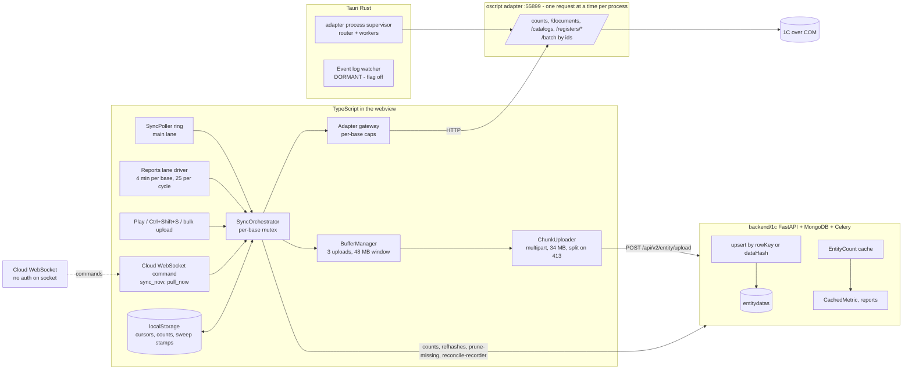
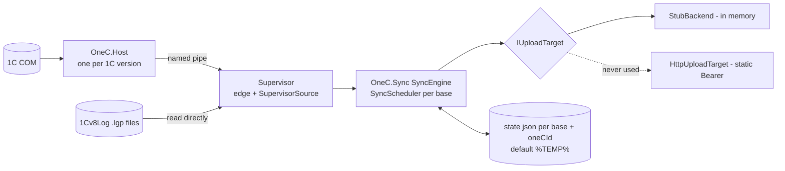
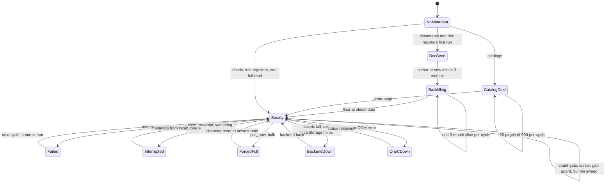

# Sync architecture audit

Date: 2026-09-30. Read-only. Nothing was uploaded, written to 1C, committed or pushed.

> Historical audit. "The rewrite's `OneC.Sync`" below is the milestone 5.9 engine, deleted on
> 2026-10-02 (D48); the engine designed from this audit now carries the name `OneC.Sync`
> (`SYNC_ENGINE_ARCHITECTURE.md`).

**Sources.** Four code investigations, each following the code over the docs:

| Tag | Scope | Revision read |
|---|---|---|
| **[TS]** | Old Connector TypeScript sync (`D:\aiba\connector\apps\app\src`) | `release` @ afcaca7 |
| **[RS]** | Old Connector Rust + `main.os` adapter (`src-tauri`) | `release` @ afcaca7 |
| **[BE]** | Backend `D:\aiba\backend\1c` (+ `next-modules/onec`, Rust, noted where it differs) | `development` @ f116e30 |
| **[RW]** | The rewrite (`D:\aiba\1c-arch`), `OneC.Sync` + EventLog + Host reads | working tree |

Paths and line numbers come from those reports. Where I re-read code myself it says **(verified)**. Everything else is "read by an investigator, not run". Nothing was measured by this audit; every number in section 19 comes from `DOTNET_REWRITE_PERFORMANCE.md` or a code comment, and is labelled.

Classification used throughout: `CONFIRMED BUG`, `CORRECTNESS RISK`, `PERFORMANCE PROBLEM`, `ARCHITECTURAL DEBT`, `UNNECESSARY COMPLEXITY`, `LEGACY COMPATIBILITY`, `UNKNOWN`.

---

# 1. Executive summary

**What the old sync actually is.** A poller and orchestrator that live in the **webview** (TypeScript, about 3 200 lines in `sync-orchestrator.ts` alone), talking to the 1C adapter over HTTP on `:55899` and to the cloud over HTTPS. Rust does not sync: it spawns the adapter and, dormant, tails the event log. Change detection today is **count gate + date cursor + "gap guard" + 30-minute header sweeps + register reconcile after a sweep**. It is a set of heuristics, not a feed.

**The event log is not in use.** A Rust event-log watcher (about 4 600 lines) and a 1 250-line TS driver exist, but `isEventLogSyncEnabled()` is hard-coded `return false` (`utils/dev-settings.ts:80-86`, verified, since 2026-09-28). Its own comment says the adapter's `/changes` route "is a recent-document-date query, not a modification feed". So the rewrite's event-log reader does **not** replace something that works in production. It replaces a mechanism that was built and switched off.

**What the backend really guarantees.** Rows are upserted by `rowKey` (`__rowKey`, else the GUID in `id` or `Ref_Key`). A keyed row that changes is **updated in place**. A row without a key is deduplicated by content hash, so an edit becomes a **second row**. Inserts use `ordered=False` and swallow every duplicate-key error, so two rows that collide are dropped silently and the insert count is over-reported. There are **no transactions**, **no ordering guard** (last writer wins), and **deletes are entirely the client's job** (`prune-missing`, `reconcile-recorder`); neither updates counts or caches.

**The rewrite's `OneC.Sync`** has a better skeleton: event feed first, tail cursor taken **before** the cold read (the cold-sync race is handled by design), state saved only after the backend accepted a page. But it is not wired into the desktop app, has only ever talked to its own stub, and has four confirmed defects in its incremental path (section 22, R-1 to R-4).

**Headline findings.**

1. **Stale and ghost register movements can stay in the cloud** in the old sync (F1, F2), which corrupts reports quietly. The rewrite fixes part of this for accounting registers only.
2. **The backend silently drops or duplicates rows** in several situations (B-1 to B-4) and cannot tell the client. Any new sync client inherits this unless the backend changes.
3. **The old connector marks a fully failed sync as a success** (F3) and can hang a run for ever after Pause then Cancel (F7).
4. **The rewrite's incremental mode can loop or re-read everything**: a non-periodic information register with 500 or more rows re-uploads the same page for ever (R-2); any information-register event resets the whole table (R-1).
5. **The upload target has never been tested against a real backend**, and `HttpUploadTarget` has no allow-list. D41 is enforced only by "the app never starts it".

---

# 2. Old sync architecture

The rewrite, for comparison:

Three things to read from the pictures:

- Old: the sync brain runs in the UI process and holds its state in `localStorage`. The Rust process has no part in it.
- Old: two independent lanes (main and reports) both go through one orchestrator and one mutex per base. Concurrency is real only across bases.
- Rewrite: one engine with one pass per base and no local queue. There is no lane concept, no cloud commands, no presence, and the desktop app never starts it.

---

# 3. Sync entry points

| Trigger | Code | Scope | Concurrency guard | Debounce | Retry | Cancel | State dependency |
|---|---|---|---|---|---|---|---|
| Startup poller | `info-base-sync-provider.tsx:958-1015`, `sync-poller.ts:141-152` | every eligible base, ring order | see next row | first tick at once | see next row | poller stop on unmount | `lastSyncedAt` in localStorage |
| Poller timer | `sync-poller.ts:206-359` | main-lane tables of one base | `inFlight`, `starting`, `syncingRef`, `lastAttemptAt` floor, pause and preempt sets, quarantine, adapter status, write-pending, pool slots | 60 s per base (dev-settings, clamped 1-120 min) | a thrown failure re-picks after about 150 ms; **3 throws quarantine the base 5 min**. Table failures do not throw, so they never count. | abort registry, lane `main` | localStorage, backend sync-tables list per pick |
| Reports lane | `reports-lane-driver.ts:315-374` | reports tables + retail turnover push | own `inFlight`, pool of 3, at most 25 bases per cycle | 4 min per base | 3 failures quarantine 30 min | lanes `reports`, `turnover` | in-memory only |
| Play button | `column.tsx:92`, provider `:428-533` | one base, cursor mode | `syncingRef`; orchestrator answers `busy` | none | none | lane `main` | none |
| Ctrl+Shift+S | provider `:843-852`, `:735-808` | all eligible bases, serial | `bulkSyncRunningRef` | none | none | per base | none |
| New base created | `create-modal.tsx:57,65` | that base | as play | none | none | none | none |
| Bulk upload dialog | provider `:548-706` | chosen tables, `mode:"full"`, urgent | preempt claim; aborts other lanes; waits 8 s; **then force-clears `syncingRef`** | none | none | lane `bulk` | none |
| Cloud `sync_now` / `pull_now` | `onec-sync-provider.tsx:1896-2191` | whole base or `payload.tables` (targeted runs preempt unless `priority:"low"`) | own `commandSyncingRef`, own orchestrator instance | none (ack sent first) | none (cloud re-sends) | lane `cloud` | `pull_now` is always `mode:"full"` |
| WebSocket reconnect | `onec-sync-provider.tsx:15140-15290` | none | none | 1-30 s + jitter | reconnect timer | none | reconnect sends `hello` only; **offline commands are not replayed** |
| Sync-list change | provider `:958-1015` | new base due at once | as poller | none | none | effect aborts removed base | none; editing the table list does not force a sync |
| Full resync | `sync-orchestrator.ts:456,1095` | every table from offset 0 | as the trigger | none | none | as the trigger | no local state reset |
| Retry after failure | `sync-orchestrator.ts:2923-2945` | failed table only | none | the interval | next cycle | none | cursor not advanced |
| Post / write-triggered refresh | **none** | none | none | none | none | none | write gate only *pauses* sync; `refreshTargetedDocument` has no callers |
| Backfill | `sync-orchestrator.ts:2732-2897` | one 3-month slice per cycle | inside a normal run | none | floor stays on failure | as the run | `backfillFloor`, `dataMinDate` |
| Event log | Rust `eventlog.rs`, TS `eventlog-driver.ts` | file bases | n/a | n/a | n/a | n/a | **disabled (`return false`)** |

**Can two syncs run on one base?** Not through the normal paths. `syncMutexChainByBase` (`sync-orchestrator.ts:224-310`) is module-level, keyed by `adapterDbName`, shared by every orchestrator instance (poller, cloud, reports, bulk). Its stall watchdog force-releases after 10 minutes without adapter activity. Exceptions, harmless only because uploads are idempotent for keyed rows:

- a parked run releases the mutex, so another lane can interleave (`:643-646`);
- after a watchdog force-release, a wedged run may still be unwinding (`:271-287`);
- the bulk dialog force-clears `syncingRef` while the old run may still be alive (`provider:634-639`);
- four separate "syncing" sets exist (provider, command, reports lane, eventlog). Only the mutex is a real cross-lane exclusion.

The rewrite: one pass at a time per base, bases in parallel with no cap (`SyncScheduler.cs:53`). One trigger only: a timer.

---

# 4. Full sync flow

## 4.1 State machine that is actually implemented (old)

Situations:

- **First-ever sync.** Documents and accounting/accumulation registers seed the **newest 3 months only** (`initialBackfillFloor`, `sync-orchestrator.ts:1463-1466`), anchor the cursor, then walk history backwards one 3-month slice per cycle. Catalogs are cold-read as a keyset walk, 20 pages of 500 per cycle. Charts and information registers are one full read.
- **Interrupted / app restart.** There is **no per-page checkpoint** for documents or registers. The cursor is written only after the table finishes and flushes (`:2588, 2691-2707`). Three things persist earlier: catalog cold-read position, backfill floor, sweep stamp. The comment at `table-metadata-storage.ts:282-285` ("cursors are written per PAGE") is true only for the catalog cold read. A crash means the unfinished range is read and uploaded again.
- **Backend unavailable.** Counts fall back to the localStorage mirror and surplus detection is suspended. Uploads fail after about 19 s of retries, the table is skipped, the run ends `partial`. The poller treats `partial` as success, so it never backs off (F15).
- **1C unavailable.** A COM error gives outcome `com-error`; the poller skips bases whose adapter status is `error`. **But a run where every count check fails and no always-full catalog exists returns `no-changes` and is stamped as a successful, active sync** (F3).
- **Corrupt local state.** `localStorage` quota errors are swallowed and warned once, and sync appears healthy while cursors stop persisting (F8).
- **Force resync.** `mode:"full"` skips the count gate but also disables probe scan, sweep, delete detection, cold-read chunking and backfill windows (`:1372-1377, 1859-1863, 2127-2150`). **A full pull never removes rows deleted in 1C.**

## 4.2 What a cold sync does per family

See the matrix in section 6. Ordering rule: reference catalogs before documents before movements (`core/config.ts:~296-329`), accounting register night-only by default (`sync-tables-config.ts:43`).

## 4.3 The rewrite's pass (`SyncEngine.cs:51-70`)

1. Skip chart-of-accounts tables with a warning (no read op exists).
2. If there is no feed cursor, take the event-log **tail** and save it.
3. Cold-read each table not marked done, sequentially, 500-row pages, save state after each accepted page.
4. Replay the feed since the saved cursor.

---

# 5. Incremental sync flow

Mechanisms, in the order the old orchestrator applies them:

| Mechanism | Code | Detects | Blind to |
|---|---|---|---|
| Count gate | `table-count-checker.ts:48-82` | net row-count deltas | in-place edits; a delete offset by an insert; surplus is acted on **once per (adapter, backend) count pair** |
| Date cursor | `incremental-fetcher.ts:969-1129` | documents and register rows dated after the watermark | back-dated rows, edits, rows at the watermark second with a smaller id |
| Gap guard | `sync-orchestrator.ts:1947-2075` | count gap after the cursor read: ref-diff for docs, key-diff for registers | see below |
| 30-min sweep | `:2109-2574`, `probe-scan.ts:132-163` | header edits: `posted`, `deletionMark`, `date`, `СуммаДокумента`; physical deletes | line changes that keep the total; counterparty, contract, warehouse changes; capped at **25 re-reads per sweep** |
| Probe scan | `:1708-1854` | catalog edits over a projection | fields outside the projection |
| Register reconcile | `register-reconcile.ts:202-261` | ghost rows of documents the sweep flagged | changed amounts on unchanged keys |
| Event log | disabled | n/a | n/a |

**What each real-world change looks like:**

| Change in 1C | How the old sync finds it | Reliable? |
|---|---|---|
| New document, dated ahead of watermark | cursor | yes |
| New document, back-dated | gap guard or sweep | heuristic |
| Document edited (total changes) | sweep, within about 30 min or longer on big tables | mostly |
| Document edited (total same) | not found until something else moves | **no** |
| Post / unpost | sweep sees `posted` flag | yes for the header; **movements: see F1/F2** |
| Repost with changed amounts | header may change; register rows are **not** re-uploaded | **no** (F1) |
| Physical delete | sweep, two consecutive complete scans, then `prune-missing` | slow but works, capped |
| Deletion mark | header `deletionMark` re-uploaded as a flag, row not removed | as designed |
| Catalog rename | probe scan if the field is in the projection | partial |
| Information register change | no detection at all | **no** |
| Rolled-back transaction | invisible (COM reads see committed state) | n/a |
| Direct DB change | invisible to event log; visible to COM reads | n/a |
| Background job writes | indistinguishable from any write | n/a |

**Known blind spots in the gap guard (F5).** Edits count as fetched rows and can hide a back-dated insert (`adapterCount > backendCount + result.totalFetched`); the guard is suspended for the whole backfill or cold read; a document dated up to 366 days in the future pins the cursor ahead of real entries; the register cursor tie-break id is `Регистратор` + `НомерСтроки` where `Регистратор` is the **document number**, not a unique id; an empty `cursorId` drops every row at the anchor timestamp.

## The cursor / cold sync / concurrent change race

- **Old.** There is no "take cursor first" step. The watermark is the maximum date seen while streaming, committed after `flush()`. Rows created during a long read are found by the next cursor read only if they are dated ahead; back-dated or edited rows rely on the gap guard and the sweep, and both are **suspended while a backfill or cold read runs**. Ordering data, then flush, then cursor is correct. The race is handled by eventual-consistency backstops with holes, not by design.
- **Rewrite.** Handled by design. The tail cursor is taken and saved **before** any read (`SyncEngine.cs:58-63`); replay happens only after all cold reads finish; if any cold read throws, the pass aborts with the cursor still at the old tail, so nothing is skipped; replay re-reads by id, which is idempotent. Residual holes: no log files yet on first pass (cursor stays null, so the replay starts at the tail and events during the cold read are lost: `SyncEngine.cs:58-63`, `EventLogReader.cs:59,64`); a cold read that outlives log retention gets a `cursor_file_gone` reset and starts over (possible livelock on multi-hour cold reads). **Not proven by any test**; only the live test runs the sequence, on tiny data.

---

# 6. Entity matrix

Old connector (upload endpoint for all rows: `POST /api/v2/entity/upload`, multipart):

| Entity | 1C source / read | Pagination | Row key (client) | Parallel | Page | Delete strategy | Checkpoint | Special |
|---|---|---|---|---|---|---|---|---|
| Catalogs | `/catalogs/*`, JSON (XDTO bulk if flag) | cold read keyset `after=<ref>`, then full keyset walk from NIL uuid on any count change | GUID `id` | no | 500 | 30-min sweep, two-strike, `prune-missing` | `coldReadAfter` per page after flush | **any count change re-reads and re-uploads the whole catalog** (F12) unless it is a hash-diff table (charts, some catalogs) |
| Контрагенты, Банки, Номенклатура | as above + projection scan | keyset | GUID + `__rowKey`/`__rowHash` | no | 500 | delete detection in the scan | as above | Номенклатура probe-scans only when selected |
| Charts of accounts | `/charts/*` | offset += page | `code` if `id` is not a GUID | no | 500 | none | n/a | full read each selection, hash diff on upload |
| Documents | `/documents/*` header + tabular | seed ascending from floor; later `cursorDate` + skip; full read descending | GUID `id` (backend derives the key; no `__rowKey` on the scheduled path) | no | 500 (1000 above 50k rows, adaptive to 1) | sweep on `posted`/`deletionMark`; prune after two strikes | cursor after flush; backfill floor per slice | future-date clamp 366 days; `Document_ЧекККМ` never automatic (policy) |
| Information registers | `/registers/info/*` | cursor if a timestamp exists, else offset = backend count | null (content-hash dedup) | no | 500 | **none** | as documents | not backfillable; an edited row is a second row |
| Accumulation registers | `/registers/accumulation/*` | cursor asc | `recorderRef#lineNo` if `recorderRef` is present, **else `Регистратор#НомерСтроки`** (adapter emits no `recorderRef` for accumulation) | cold parallel only on full reads with `COLD_READ_WORKERS>=2` | 500 | ghosts via document reconcile only | as documents | order by `Период` only; no `orgRef` emitted |
| Accounting register | `/registers/accounting/*` (virtual table with a row-count window) | cursor asc, 3-month slices | `recorderRef#lineNo` | as above | 500 | as above | as documents | night-only; up to 18.9 M rows on Kanstik; `skipTotal` only accepts `"1"` |
| Stock | `GET /stock` | none | n/a | no | whole snapshot | replaced wholesale (`stock-snapshot`: delete all then insert; an empty result **wipes the snapshot**) | none | every cycle |
| Write metadata | schema, enums, charts | n/a | n/a | no | n/a | n/a | 6 h TTL | main lane only |

Rewrite:

| Entity | Read | Pagination | Row key | Parallel | Page | Delete | Checkpoint |
|---|---|---|---|---|---|---|---|
| Catalog | `CatalogPageAsync` | keyset `Ссылка > after` | `id` | no | 500 | feed `Delete` event, or by-id read returns nothing | per accepted page |
| Document | `DocumentPageAsync` | `Дата, Ссылка`, date cursor + skip | `id` | no | 500 | feed event; re-read by ids (200 per call); missing = gone | per accepted page |
| Accounting register | `RegisterPageAsync` | date cursor + skip | `recorderRef#lineNo` | no | 500 | reconcile by recorder | per accepted page |
| Accumulation register | same op | same | **null** (keyless) | no | 500 | reconcile cannot address rows | per accepted page |
| Information register | same op | date cursor if periodic; **none if not** | null | no | 500 | none; any event resets the table | per accepted page (**loops** if non-periodic) |
| Chart of accounts | **no read op** | n/a | n/a | n/a | n/a | n/a | skipped with a warning every pass |

---

# 7. Event log

## 7.1 Old reader (Rust, dormant)

- Architecture: watcher polls every 3 s, round-robin of at most 64 bases, cheap `stat` gate; emits Tauri event `eventlog:changed`; the frontend must `eventlog_ack`. The adapter never reads the log.
- Cursor: `{lgf_guid, file, offset, overflow_owed?}`, persisted in `eventlog-cursors.json` with a plain `fs::write` (non-atomic, no version). A corrupt or missing file loads as an empty map, so every base takes a **silent** jump to the tail.
- Reset paths: log recreated (instance GUID differs), file gone, truncated in place, record over the 8 MB cap, restart with a stale cursor (look-back of about 10 minutes, always with overflow). Rotation to a new segment is lossless but delayed to a 15-tick sweep (about 45 s). `1Cv8.lgd` (SQLite) logs are not tailed.
- Overflow: more than 2 000 qualifying events in one tick clears the queue and sets a durable `overflow_owed`, cleared only by an ack at or after that position. The frontend then does a full resync (30-minute cooldown).
- Delivery is at-least-once (a panic or a webview reload rewinds to the acked cursor). Cursor writes clone the map, drop the lock, then write, so an older snapshot can overwrite a newer one.
- **First sight jumps to the tail and history is not replayed by design** ("scheduled sync owns history"). The first-sight tail is not persisted until an ack.

## 7.2 Rewrite reader (`OneC.EventLog`)

- Pull design. The caller owns the cursor `lgfGuid|file|offset`. Validated on parse. A null cursor returns the tail and no events.
- Reset reasons: `log_recreated`, `cursor_file_gone`, `log_truncated`, `record_over_cap`.
- 8 MB per call. Files read in name order. Incremental `1Cv8.lgf` dictionary cache.
- Kinds: New, Update, Post, Unpost, Delete only (same as old).
- Server bases only when ragent runs on this machine (`LogLocator`); remote returns `not_local` and the edge answers 409.

## 7.3 Comparison

| Aspect | Old (dormant) | Rewrite | Notes |
|---|---|---|---|
| Cursor format | struct in JSON file | `guid\|file\|offset` string, caller-held | rewrite persists it in `BaseState` |
| Rotation / truncation / recreation | handled, with overflow and look-back | handled, reported as `Reset` | rewrite relies on a full re-read |
| Transaction ids | ignored | `TxId` from field 2 | **rewrite is right** |
| Rollback markers | drops records lettered `R` | drops data records of a transaction whose Begin marker is `R` | see below |
| Commit markers | not used | not used (`C` never consulted) | data records are lettered `U` |
| Duplicates | possible (at-least-once) | possible; engine collapses per object per batch | idempotent re-reads make this safe |
| Ordering | file order | file order | same |
| Crash / restart | cursor file, non-atomic | state file, temp + rename, no fsync | |
| During a cold sync | independent of it | tail taken first, replay after | rewrite is correct in design |

**Rollback: the old filter never matched (F-RS-1, CONFIRMED BUG).** `eventlog.rs:1792` drops records lettered `R`, but a read of the real bilim log (two segments, 6 438 data events) shows **every data event is lettered `U`**; `R` appears only on transaction markers: Begin (ev 7) 10 times and Rollback (ev 22) 10 times. Groups look like `C7 U… C10` for commits and `R7 U… R22` for rollbacks. About 3% of transaction groups in that sample were rollbacks, and every write inside them was reported as a change. The rewrite's decision D36 records the same finding. The rewrite tracks the transaction instead, and a rollback split across two reads only yields an extra change (a by-id read that then finds nothing, which prunes a key that never existed).

**Dictionary race (CORRECTNESS RISK, both readers).** The dictionary (`1Cv8.lgf`) is parsed first, then `.lgp` is read. Records with an unknown event or metadata id are dropped silently and the cursor advances. A new id whose dictionary line lands between the two reads loses its first event.

## 7.4 What the log can and cannot see

- Sees: post, unpost, repost (as `Post`/`Unpost` plus `Update`), physical delete, register writes (as an event on the register: for recorded registers such as Хозрасчетный the data is `{"R", 708:<recorder ref>}`; for information registers the data is `{"U"}` with **no ref**), writes by background jobs.
- Does not see: direct database writes.
- **UNKNOWN**: deletion mark (presumably an `Update`, never confirmed), catalog rename or merge, base restore from backup, whether a data record can be read before its transaction commits (every observed group has its Begin marker with the final letter, which suggests a group is written as a unit, but it is not proven).
- Registers written as record sets (`{"P",…}`) carry a null ref. The old Rust comment says so (`eventlog.rs:4337`) and the rewrite's own fixture asserts it. The investigators disagreed about whether *accounting* register events carry the recorder ref; the bilim sample says yes for Хозрасчетный. Either way the rewrite's handling only depends on the ref being null or not (section 22, R-1).

---

# 8. Identity and row keys

| Entity | What the client sends | What the backend does with it | Can identity change? |
|---|---|---|---|
| Catalog | `id` GUID | rowKey = GUID from `id`/`Ref_Key` (stripped, **not lower-cased**) | merge, re-parent |
| Document | `id` GUID | same | never (GUID is stable) |
| Chart of accounts | `code` | explicit `__rowKey` | code edit |
| Accounting register | `recorderRef#lineNo` | keyed | **line numbers change on repost** |
| Accumulation register (old) | `Регистратор#НомерСтроки` fallback (document number) | keyed | number is not unique across days or document types (`sverka` notes); `lineNo` defaults to `"0"` |
| Accumulation register (rewrite) | none | content-hash dedup | edit = new row; reconcile cannot address it |
| Information register | none | content-hash dedup | edit = new row |

The backend's dedup key is `(oneCId, tableName, rowKey)` (unique partial index) **and** `(oneCId, tableName, dataHash)` (unique, not partial). `dataHash` is `sha256(json.dumps(item + companyId, sort_keys=True, ensure_ascii=False))` and mutates the stored `rawData` by adding `companyId`. It is insensitive to key order and whitespace, sensitive to value types (`1` vs `1.0`), null vs missing, array order and **`companyId`**. The connector's own `rowHash` is a different hash (sha256 of recursively sorted canonical JSON without `companyId`); the backend stores it and never recomputes or compares it.

Consequence for a new client: rows must carry `__rowKey`; keys must be **unique within a batch** (first one wins, the rest are dropped silently); GUIDs must be in one canonical case.

---

# 9. Delete and repost semantics

| State in 1C | Old client | Backend | Result in cloud |
|---|---|---|---|
| Physically deleted document / catalog item | sweep, two consecutive complete scans, `scanned == adapterCount`, then `prune-missing`; list capped at 500 | prune guards: 409 if stored count is 0; 409 if `len(keys) > max(1, 5% of stored)`; `dryRun` supported; `$or[rowKey, refId, rawData.id]` (last branch **unindexed**) | removed, slowly; a mass delete over the caps never applies (F14) |
| Marked for deletion | header re-uploaded with `deletionMark` | stored as a field; readers filter on it | row stays, flagged |
| Unposted | header re-uploaded with `posted:false`; register ghosts reconciled **only if F2 does not bite** | nothing cascades | **movements can remain** |
| Reposted, same line keys, changed amounts | header changes only if the total does; **register rows not re-uploaded** | no version guard | **stale amounts remain** (F1) |
| Reposted, fewer lines | reconcile with the live key set of that recorder | `reconcile-recorder` deletes rows of that recorder not in `liveKeys`; empty means delete all of that recorder's rows | correct if reached |
| Register row deleted with no document event | none | none | remains |
| Forced full resync | never deletes | n/a | remains |

Rewrite:

| State | Handling |
|---|---|
| Delete event | prune by key; reconcile every configured accounting and accumulation register with an empty live set |
| Post / Unpost event | re-read movements by recorder (up to 100 000 rows, `HasMore` ignored), upload, `reconcile-recorder` with the live keys |
| Repost with fewer lines | correct for accounting (keyed). For accumulation (keyless) `liveKeys` is empty and nothing is dropped. |
| Deletion mark | ignored unless an `Update` accompanies it (UNKNOWN) |
| Feed reset | every table re-read, **no prune**; deletes in the gap stay |
| Two-sweep delete detection | **not ported** (decision D39) |

**Stale movements remain in the cloud** in the old sync, in two ways: changed amounts on an unchanged key set are never re-uploaded (F1), and ghost rows are not reconciled when the register is outside that run's `tables` (F2). The backend never cascades from a document state to its register rows (BE section 4). `register_lines` / `doc_rows` projections are env-flagged and off by default; a dangling projection line survives until a backfill prune.

---

# 10. Backend contract

Mounts: `/api/v1`, `/api/v2`, `/api/internal/admin` (service secret), `/api/internal/connector` (**no auth**), WebSocket `/api/v2/connector/ws` (no auth, identity self-declared).

**Auth reality.** `get_current_user` returns `{is_service:true}` with **no user id** for a service secret. The ownership check then denies. So upload, prune, reconcile, counts and refhashes are effectively **JWT-user only**; only `/sync-tables`, `reports/retail-rollup/ingest`, `GET /entity` and `POST /onec` handle service callers. The user check is "owner, or `check_company_access`" (a backend HTTP call cached 300 s in Redis, returning `[]` on failure).

| Endpoint | Auth | Request | Response / behaviour | Retry safe? |
|---|---|---|---|---|
| `POST /api/v2/entity/upload` | JWT | multipart `oneCId` + `file` (UTF-8 JSON `{table:[rows]}` or `{oneCId:{table:[rows]}}`); whole file read into memory; **no body limit in the app** (edge proxy 413) | 201 `{results[{tableName,entityType,total,inserted,updated,collapsed,skipped}], totalInserted, ...}`; **400** for bad UTF-8, non-object root, no non-empty tables; **409** if `status=="deleting"` (`entitiesPurging` is **not** checked); a non-dict row = **500** for the whole chunk | keyed and hash rows: yes. Not atomic across tables. |
| `POST /api/v2/entity/stock-snapshot` | JWT | `{oneCId, rows}` | delete all `STOCK_BALANCE`, then insert in 500s; empty rows wipe it; no `EntityCount` update | idempotent as a replace; **not atomic** |
| `POST /api/v2/entity/data-coverage` | JWT | `{oneCId, tables:[{table,dataFrom,complete}]}` | read-modify-write merge into `OneC.dataCoverage` | idempotent per key; **lost-update race** with heartbeat or the other lane |
| `POST /api/v2/reports/retail-rollup/ingest` | JWT or service | up to 1 000 000 rows | replace window: `delete_many` then insert | idempotent; empty window in between |
| `GET /api/v1/onec/{id}/counts?scope=` | JWT | none | `[{tableName,quantity}]` from the `EntityCount` cache, else cold per-table counts (7-14 s on 3-6 M rows, per code comments) | read |
| `GET .../refids?table_name=` | JWT | none | streams the whole partition, unpaged | read |
| `GET .../refhashes?table_name=&digest=1&buckets=` | JWT | none | `{rowKey: rowHash}`; digest mode returns bucket digests only; the full map sorts by `(updatedAt,_id)` with **no index** (17.5 MB / 31 s seen) | read |
| `POST .../reconcile-recorder` | JWT | `{tableName, recorderRef, liveKeys[]}` | deletes rows of that recorder not in `liveKeys`; no count or cache update | idempotent |
| `POST .../prune-missing` | JWT | `{tableName, missingKeys[], liveCount, dryRun}` | guards in section 9; no count or cache update | idempotent |
| `GET/PUT .../sync-tables` | JWT or service | table list | `null` = unconfigured; PUT is a full replace | idempotent |
| `PATCH /onec/connection/{id}` | JWT | status, totalCount, version... | **409 if `deleting`**; a PATCH can also change `userId`, `companyId`, `provider` with no check on the new company | idempotent |
| `DELETE /entity/oneC/{id}` | JWT | none | sets `entitiesPurging`, sends `tasks.purge_onec_entities`, 202; the purge matches `oneCId` as ObjectId only | idempotent |
| `GET/PUT /onec/{id}/org-bindings` | JWT | whole set | replaces bindings; remap does `update_many` on `EntityData.companyId` but not on `rawData.companyId` or `dataHash` | idempotent |
| `POST /onec/connection/rebuild`, `/backfill-total-count` | **none** | optional `oneCId` | **without `oneCId` deletes every `CachedMetric` and `EntityCount` fleet-wide** | see B-6 |
| `POST /api/v1/entities/upload` | JWT | same | **always 500** (`create_data_hash(item)` missing an argument) | n/a |
| `POST /api/v2/entity`, `/entities` | JWT | | enqueue `tasks.create_entities`, which **does not exist** | n/a |
| `WS /api/v2/connector/ws` | none | `hello`, `heartbeat`, results by `requestId` | Redis presence TTL 90 s | n/a |

Data model, meaning of `oneCId`: it is the `_id` of one **partition document** in `onecs`, not a 1C base GUID and not a company. A legacy single-org base is one document. A multi-org base is one **connection** document (which also owns the shared partition) plus one **binding** document per organisation. There is no physical-base identity field: base identity is `(companyId, odataName, name)`, and the unique check is check-then-insert in code (`validate_onec_create`), not a database index. `oneCId` is an ObjectId on new rows and a string on legacy rows, and several paths only handle one form.

The Rust `next-modules/onec` reimplements the same routes on Postgres and differs in ways that matter for a client: it sniffs gzip, keyed rows use `ON CONFLICT ... DO UPDATE` (no swallowed drops), plain rows use `DO NOTHING`, and it accepts a service secret or JWT. **Which backend the rewrite targets is an open decision (section 25).**

---

# 11. Organisation routing

- **The backend does not route.** Upload takes one `oneCId`; nothing in the upload path looks at `orgRef`.
- **The connector routes.** The adapter reads the whole base once and tags rows with `orgRef` (a GUID). Documents, by-id reads, catalogs and the accounting register carry it; **accumulation and information registers do not** (no `orgRef` in `main.os:18365-18676`). `org-router.ts` treats all `Document_`, `AccountingRegister_`, `AccumulationRegister_`, `InformationRegister_` tables as **movement tables**: each row goes to the binding whose `orgRef` matches. Everything else (catalogs, charts, `Meta1C_*`) goes whole to the **shared partition** (the connection). Rows for an unmapped org are dropped and counted. **Movement rows with no org land in the shared partition, where no company reads them** (warned, not fixed). This is a confirmed gap for accumulation and information registers on multi-org bases.
- **Backend classification** (`is_movement_table`, `onec_scope.py:66-104`) must match the connector's `isMovementTable`. It also lists bare `stock`. `InformationRegister_ДокументыФизическихЛиц` is classified per-org although it may not be org-scoped in 1C (UNVERIFIED).
- **Org-map source.** `GET /onec/{id}/org-bindings` (cloud records). The connector syncs only the **connection** and uploads to bindings; the event-log driver filters binding rows so a 19-org base is not fanned out.
- **Rules on bindings:** `orgRef` is lowercased; the zero GUID is rejected; one org maps to one company and vice versa; the company must be accessible to the caller.
- **Reads** use `scope_own_ids` for movements (one partition) and `scope_shared_ids` for references (own plus the connection). `scope=connection` is refused on a binding.
- **Rewrite:** rows carry `orgRef` where the adapter produces it, but everything is uploaded to **one** `oneCId`. The auth spec says a multi-org base must not be synced single-org.
- **Not audited:** bank data (a separate service).

---

# 12. Persistent sync state

| State | Where | Format | Atomic / versioned | If deleted or stale |
|---|---|---|---|---|
| Old: table metadata (cursor, count, sweep stamp, backfill floor, `absentKeys` up to 500 GUIDs...) | `localStorage` `table_metadata:{user}:{mode}:{base}:{table}` | JSON, about 20 fields | one key per table, no version; write errors swallowed; cache updated only on success | table returns to "no metadata": docs re-seed 3 months and walk history; catalogs with a positive backend count are marked cold-read done without reading |
| Old: last-synced stamp | `localStorage` per base | JSON | | postpones or triggers the next run; **stamped by every run type** (F6) |
| Old: page-limit memory | `localStorage adapter_page_limits` | JSON | | ratchets down after a timeout and can over-ratchet |
| Old: source capability, write-metadata stamp | `localStorage`, 6 h TTL | JSON | | re-probed |
| Old: info-base list incl. credentials | zustand `aiba-infobases`, `localStorage` | JSON | | persists `syncing:true`, which can rehydrate stale |
| Old: event-log cursors | `eventlog-cursors.json` | pretty JSON map | plain `fs::write`, no version | silent tail jump for every base |
| Old: adapter config incl. 1C passwords | `1c-adapter\config.json` + 20 backups | JSON | plain writes | recovered from backup; else empty |
| Old: in-memory only | poller failures/quarantine/`lastAttemptAt`, reports-lane gates, abort and preempt registries, write gate, adapter caches | | | lost on restart; **the poller state is rebuilt on every token refresh** (F18) |
| Rewrite: `BaseState` | `{StateDir}/{base}.{oneCId}.json`, default `%TEMP%\aiba-sync` | JSON | temp file + move, **no fsync**; no version; **a corrupt file throws on load, no recovery** | full cold read, then replay from the tail |
| Backend | `EntityCount.counts`, `dataCoverage`, `EntityData` | Mongo | no transactions | see section 16 |

Quota at fleet size: table metadata is one key per table per base with up to 500 GUIDs each; the code itself names 6 000+ keys. At quota, cursors stop persisting **while sync appears healthy** (F8).

**Which state is actually necessary.** For a design that reads from a feed: a feed cursor, per-table cold-read progress (until finished), and a per-object "last uploaded" record only if you want to skip unchanged uploads. Count mirrors, sweep stamps, page-limit memory, capability caches and `absentKeys` exist to compensate for not having a feed.

---

# 13. Hashing and diffing

- **Old, row hash:** sha256 of canonical (sorted-key) JSON, about 59 µs per row (`change-detect.ts:299-306`). Used by `diffChangedRows` for hash-diff tables only. Documents compare on key presence, not hash.
- **Old, projection fingerprint and 256-bucket digests** for catalogs (`catalog-projection.ts`): a hand-mirrored copy of the backend's `probe_hash.py`, pinned by `probe-hash-vectors.json`. Three implementations (TypeScript, Python, C#) of row identity and hashing must agree.
- **Adapter does not hash.** Rust does not hash rows. The stated intent is that XDTO bulk output be byte-identical to the JSON path so hashes do not churn; a possible violation exists (bulk parse trims string cells with `trim_text(true)`; a five-space catalog code in the probe vectors would come out changed. Not run, needs a live check).
- **Cost:** a 500 k-row sweep does two sha256 per row (probe and bucket) over a `ScannedRow[]` that holds all rows.
- **Rewrite:** sha256 of the row with keys sorted, before stamping, written as JavaScript would write it (`JsJson`: `3790.00` becomes `3790`). Each row is serialised for size, then again for the body, and hashed. No local hash map to skip unchanged rows; the backend dedupes.

---

# 14. Batching and serialization

**Old, copies from a 1C row to the request** (scheduled path): adapter response text, `response.json()`; optional Rust parse plus IPC; a `JSON.stringify(pageRecords).length` used **only for a size counter**; a shallow clone in `diffChangedRows`; push into the upload buffer and `[...rows]`; `JSON.stringify` of the buffer (the string actually sent); a `new Blob([json])` **only to measure size**; `new Blob` and `new File` in the uploader; `FormData` multipart encode. About nine passes over the data.

- Page 500 (1 000 above 50 k rows, adaptive down to 1). Upload chunk up to 34 MB, halved on 413 to depth 10. Gzip is off by default and buffers the whole compressed chunk.
- **Whole-table buffers** exist: the backend ref-hash map (17.5 MB for contracts), the backend ref-id set, `fetchAllDocumentRefs`, `backdated.records` (every missing document held in memory then passed at once), `scanned[]` in sweep and probe scan, per-day `rows[]` in reconcile. Memory bound per table is 3 in-flight uploads and 48 MB, times parallel lanes, plus the adapter page.

**Backend per chunk:** the whole file is read into memory, decoded, `json.loads`. Around five Mongo round trips of fixed cost (OneC load, a re-read plus full-document `save()`, the Redis sync key, dedup queries, the counts `$inc`), then a cache-schedule and a report-invalidation call. Four uvicorn workers, `maxPoolSize=50`. Gzip: the connector's `GZIP_UPLOAD=1` assumes the backend sniffs gzip, but `development` has no such code (it exists only on `origin/perf/ingest`); enabling it against this build makes every chunk **400**.

**Rewrite:** one 500-row page at a time (RegisterByRecorder asks for 100 000), upload chunk up to 34 MB with 413 split to depth 10, feed read 8 MB per call. Memory is bounded by construction, but rows are serialised twice and hashed.

---

# 15. Concurrency and backpressure

**Old concurrency map.**

| Mechanism | Verdict |
|---|---|
| Poller slots = adapter concurrency (default 1) | useful, but one long base starves the rest; no time slicing |
| Per-base mutex + 10 min watchdog | useful as a serializer; also **defeats the reports lane's isolation** (F4) |
| Gateway caps (global normal cap, per-base slots, urgent windows, write lane) | useful; reports reads share the same per-base slot |
| Table lanes `Promise.all` | real only when a base has worker replicas; otherwise K=1 |
| Fetch to upload double buffer (depth 1) | useful |
| BufferManager (3 uploads, 48 MB) | useful; provides the only backpressure |
| Parallel cold read (up to 8 ephemeral workers) | real, but opt-in and full reads only |
| Reports pool of 3, 25 bases per cycle | useful bound |
| Event-log per-base queue and fleet budget of 120 touches/min | **dead code** |
| `PauseResumeManager.waitIfPaused` | **unsafe** (F7) |

There is **no serial-upload-after-parallel-read** problem. Uploads overlap reads, except on catalog cold read which flushes per page on purpose. The adapter is strictly serial per process, one COM connector per process; the router is on by default (auto-size `enabled_bases.clamp(2,8)`), so bases run in parallel across processes. **`CLAUDE.md` is stale here:** it says `MAX_LIMIT=250`, `MAX_NORMAL=1` and a router-less adapter.

**Backpressure.** Bounded by the upload window (3 uploads, 48 MB): if the backend is slower than 1C, 1C sits idle. **Not bounded:** backend down for hours, where every cycle re-reads pages from 1C and fails on the first chunk after about 19 s, with no circuit breaker (F15). Many bases are bounded by gateway caps, poller slots and the reports pool, with no cross-base upload bound beyond that.

**Rewrite.** Tables sequential per base, bases parallel with no cap, and reads share the same session pool as user reads and writes (D23): 4 sessions per base, `RentTimeout` 60 s, so a long cold read on a file base competes with the user. `SlicePlanner` and the slice walks (D35) exist but the engine does not call them. No queue exists, so no backpressure problem exists either, and no overlap of read and upload either.

---

# 16. Retry and idempotency

## Failure matrix (old)

| Failure | Retry | Backoff | Duplicate or loss | Checkpoint |
|---|---|---|---|---|
| 1C page fails (network, 5xx) | 4 attempts | 0.5, 1, 2 s | none | not advanced; table skipped |
| Page timeout (120 s, includes queue wait) | yes, then half the page | 60 s | none | page-limit memory shrinks and can over-ratchet |
| Terminal COM error | none | | none | base marked errored |
| Upload network error | 5 | 1, 2, 3, 5, 8 s; waits for `online` | possible replay | table fails; cursor unchanged |
| Upload 5xx, 429, 422, 401 | **none** | | none | table fails; next cycle re-reads from the old cursor. **401 is not refreshed** (F10) |
| Upload 413 | split, recursive | | none | fine |
| Upload 200 with a malformed body | thrown after storage | | replay | table fails |
| **Partial accept** | body only logged | | **silent loss possible** (F11) | advances |
| Host crash or app restart | on next start | | full replay of the unfinished range | catalog cursor and backfill floor survive; the rest replays |
| localStorage full | none | | none | cursor silently not saved |

**Rewrite:** 5xx and `HttpRequestException` retry at 1, 2, 3, 5, 8 s; timeouts (`TaskCanceledException`) are **not** retried; every 4xx (401, 403, 409, 429 included) fails at once; the scheduler backs off `min(300, 2^failures)` s and resumes from state. A refused prune (409) is turned into a **warning and the feed cursor advances** (R-5). A poison object that always returns 4xx stalls the base for ever (R-6).

## Idempotency: what it really is

- **Old = at-least-once with best-effort dedup.** Keyed rows (documents, catalogs, charts, accounting registers) upsert in place, so a replay converges. **Keyless rows** (information registers, keyless register rows) deduplicate by content hash, so a replay of an *edited* row adds a duplicate. After a crash between the backend write and the cursor commit the whole unfinished range is uploaded again; count surplus is then acted on only once per count pair.
- **Backend = idempotent for keyed and hash-identical rows, not atomic, last writer wins.** Concurrent uploads of the same rows are not serialised: a race loser's newer content is silently lost (E11000 swallowed). A stale retried chunk can overwrite a newer row. There is no version or timestamp guard.
- **Rewrite = at-least-once**, the same, with the feed cursor saved after each applied batch and table cursors saved after each accepted page.

---

# 17. Consistency and crash semantics

- **No cross-entity consistency**, old or new. There are no Mongo transactions anywhere. A document and its movements arrive in separate tables and requests. Old priorities are documents 40, accumulation 70, accounting 999, and the accounting register is **night-only**, so a document can be visible without movements for hours. Stock is a wholesale replace and can disagree with the document journal within a cycle.
- **Counts are a lossy cache.** `EntityCount` is maintained by `$inc(inserted - collapsed)` on upload only; the swallow-and-over-report insert drifts it up; updates, deletes, prune, reconcile, stock and table purge never move it; in legacy `CACHE_PASS_MODE` a live `$group` overwrites it every 60 s; `v2` mode recounts every 6 h (prod flip is a TODO per `mongo-load-todo.md`; the prod value is UNKNOWN). The `percentage` shown to users is `sum(EntityCount) / totalCount`, capped at 100, with a `totalCount` set by the connector.
- **Metric cache.** The 40 metrics rebuild only when counts differ from `rebuiltCounts`, so an in-place edit never rebuilds them; report aggregates are dropped on any upload with inserted, updated or collapsed rows; deletes do not invalidate reports.

**Crash / restart (old).** Cursors come back from `localStorage`; unfinished uploads are not resumed, they replay. **Nothing drains in-flight uploads on shutdown**: effect cleanups stop timers and abort; on `ExitRequested` Rust kills the adapter immediately. A restart of the adapter mid-request drops the TCP connection; the fetcher classifies it retryable and retries four times, and the next call pays a 6-8 s cold COM connect. A write killed mid-COM relies on 1C-side markers for idempotency.

**Startup (old).** The poller and reports lane start immediately; every base with an old `lastSyncedAt` is due at once. The adapter is started by the frontend, not at launch; the event-log watcher never starts.

**Rewrite.** State resumes from the state file. Default location is `%TEMP%`. A crash after a backend write but before `state.Save` re-uploads that page (idempotent for keyed rows). A stub run keeps state on disk while the in-memory stub restarts empty: the state file then claims data the stub does not have.

---

# 18. Cloud control plane

Separate from the data plane: commands arrive on a WebSocket owned by the webview; data moves as adapter HTTP reads and HTTPS uploads.

- **Two sockets to `/api/v2/connector/ws`.** `onec-hub.tsx` is presence only (`hello`, 30 s heartbeat, fixed 3 s reconnect) and deliberately ignores `sync_now`, `pull_now`, `read_table` so commands do not run twice. `onec-sync-provider.tsx` carries commands and presence (`hello` with `capabilities.commands`, half-open detection at 3x heartbeat, reconnect 1-30 s + jitter that **resets to 0 on any successful open**, before any server acknowledgement).
- **Auth.** No token on either socket; identity is self-declared `connector_id = userId:deviceId`. Neither socket reads close codes. (Memory note "WS 403 flap" concerns the `onec-next` lab branch; not reproducible on `release`.)
- **Commands.** Sync: `sync_now`, `pull_now`. Reads: `get_bases`, `check_exists`, `list_resource`, `refdata_get`, `document_read`, `catalog_read`, `connector_status_request`, `ping`. Writes (behind a global write gate): `write_to_1c`, `post/unpost/update/delete_1c_document`, `catalog_update`, and others. **There is no `reload_config` and no `force_full_sync` command**; "full" is `pull_now` or `sync_now` with `mode:"full"`.
- **What a sync command does.** It requires `request_id`; unmapped base gives `infobase_not_mapped`; no live user gives `user_not_authenticated`; a whole-base run while one is running gives `sync_in_progress`. A targeted run (`payload.tables`) acknowledges first, then **preempts** every lane of the base (waits up to 8 s, then force-claims) unless `priority:"low"`.
- **Ids, acks, replay.** `request_id` is only echoed. **No dedup, no in-flight tracking, no command-level concurrency limit** in the provider. A duplicate or replayed frame re-executes. Commands sent while the connector is offline are not replayed on reconnect.
- **Cloud-side dispatch (backend).** Admin routes `POST /connectors/infobase/{id}/sync?mode=cursor|full`, `read-table`, `document/{post,unpost,update,delete}`, `catalog/{update,read}` publish over Redis pub/sub with a 120 s reply timeout (300 s for writes). An offline connector returns `{ok:false,"connector_offline"}` with **HTTP 200**.
- **Other Rust control channel.** `tunnel_agent.rs` (bank signing only): dials `<backend>/ws/connector/?token=...` with the token in the **query string**, 15 s ping, 45 s liveness, fixed 3 s reconnect. Not sync.

**Rewrite:** none of this exists. No WebSocket, no presence, no commands. The desktop app does cloud login and the legacy status heartbeat only (D41).

---

# 19. Performance

All numbers below are from `DOTNET_REWRITE_PERFORMANCE.md` or code comments. They were **measured locally on KAN (Postgres) or bilim (file base), never against a customer server**, and §5.5-5.6 numbers ran beside a stuck busy core and should be re-measured before being used as limits. Nothing was re-measured for this audit.

| Path | Rate | Source |
|---|---|---|
| Old adapter, accounting register walk | 134 rows/s | perf doc (26 463 rows in 197 s) |
| Rewrite, Хозрасчетный, 250-row pages, one session | **537 rows/s**, host private 134-142 MB flat; first page 452 ms vs 2 580 ms | perf doc |
| Rewrite, parallel cold read (26 504 movements, June 2025) | K=1, 2, 4 sessions: 593, 1 072, **1 737 rows/s**; about 80 MB more per session | perf doc; **not used by `OneC.Sync`** |
| Catalog walk, ДоговорыКонтрагентов (116 757 rows) | 3 394 rows/s at 1 000/page; 2 525 at 250/page | perf doc |
| Document walk, headers only | 15 000 docs in 11.4 s (about 1 300/s), 160 MB flat | perf doc |
| Document walk with tabular sections | 68.7 s for the same walk, 206-238 MB; a 250-doc page 637 ms vs 4 773 ms (old algorithm) | perf doc; the table row names 25 000 docs / 175 953 lines (ambiguous) |
| Event log read | **98 MB/s**, 2 GB `.lgp` in 21.2 s, 119 MB private, 0 1C sessions; 4.6 M records, 361 224 data events | perf doc |
| Sync end to end | Банки 500 + ПТУ 19 + Хозрасчетный 27: 33 s incl. first connect; post then delete of one copy reached the stub in **87 s** (delay not split) | perf doc |

**Estimated, not measured:** a 3 M-row Хозрасчетный cold read is about 93 minutes single-session (3 000 000 / 537 rows/s). Reconcile fan-out cost. **No large cold sync of either engine, and no upload throughput of either engine, has been measured.**

**Where the time goes, per family** (inferred from the above plus code):

- **Catalog:** 1C read is fast (2 500-3 400 rows/s). The old sync's cost is **re-reading and re-uploading the whole catalog on any count change** (F12), so upload, JSON and the backend's per-chunk cost dominate. The rewrite cold-reads once and then re-reads by id: one by-id read per changed item, serial.
- **Document:** 1C tabular rendering (68.7 s vs 11.4 s for the same 15 000 documents). Page-size adaptation and 120 s timeouts matter for big bases.
- **Accounting register:** the 1C read itself, single-threaded, plus `O(skip)` per page when many rows share one `Период`. The 1 737 rows/s parallel result is available in the code base but unused.
- **Event-log incremental:** the log read (98 MB/s) is not the bottleneck. The cost is the by-id re-reads and, in the rewrite, the reconcile fan-out (one 1C query and one HTTP call per configured register per Post/Unpost, no batching).
- **Backend:** whole-file `json.loads` per chunk, about five round trips of fixed cost per chunk, a full `COUNT` per prune in the rewrite, a full-partition `$group` every 60 s in legacy count mode, and the unindexed `rawData.id` branch in `prune-missing`.

---

# 20. Confirmed bugs

Old connector (from [TS]/[RS]; I re-read only the disabled event-log flag):

| ID | Bug | Evidence |
|---|---|---|
| F1 | **Stale register amounts are never repaired.** Reconcile is delete-only. A repost that keeps the same line keys but changes amounts moves only the document header; the register cursor is past that date and counts are unchanged, so nothing re-uploads the movements. | `register-reconcile.ts:191-197`, `sync-orchestrator.ts:1965, 2480-2494` |
| F2 | **Reconcile is scoped to the run's `tables`.** A daytime sweep re-uploads the changed document and consumes the stale flag but never reconciles the accounting register (night-only), and the night sweep no longer sees the document as stale. Ghost movements stay. | `sync-orchestrator.ts:2357-2361, 2507-2513`, `sync-tables-config.ts:43,59-64` |
| F3 | **A failed count check is stamped as a successful, active sync.** If every count fails and no always-full catalog exists, `tablesToSync` is empty and the run returns `no-changes`, which calls `incrementSyncCount` and `setConnectionActive`. | `sync-orchestrator.ts:1095-1107, 1148-1185, 1129-1137` |
| F7 | **Pause waiters are orphaned.** One resolver per id; `clear()` deletes it without resolving; the wait is not abort-aware. A pause followed by Cancel leaves the run stuck, so its `finally` never runs and `markConnectionSyncing(false)` is never called (heartbeat then suppressed). | `pause-resume-manager.ts:208-222`, `sync-orchestrator.ts:650-657, 3189-3200` |
| RS-1 | The rollback filter never matches (data events are lettered `U`; rollback is on markers). Rolled-back writes are reported as changes. | `eventlog.rs:1792` vs bilim log; rewrite D36 |
| RS-2 | `/changes` is not a change feed; it returns recent documents by **document date**. | `main.os:19668-19830`; `dev-settings.ts:80-86` |
| RS-3 | Accumulation and information register rows carry no `orgRef`, yet are routed as movement tables; on a multi-org base they land in the shared partition where no company reads them. | `main.os:18365-18676`, `org-router.ts` |
| B-1 | `POST /api/v1/entities/upload` cannot work (`create_data_hash(item)` missing an argument, always 500). | `app/api/v1/routes/entity.py:249` |
| B-2 | `POST /entity` and `/entities` enqueue `tasks.create_entities`, which no worker defines. | `entity.py:297` |
| B-3 | **Two unauthenticated destructive routes**: `POST /onec/connection/rebuild` without `oneCId` deletes every `CachedMetric` and `EntityCount` fleet-wide. | `v2 onec.py:234,255,267-271` |
| B-4 | Gzip mismatch: connector sniffs nothing, backend `development` has no gzip support, so `GZIP_UPLOAD=1` makes every chunk 400. | `chunk-uploader.ts:198`, `entity.py:349-352` |

**Rewrite** (verified: **R-1 and R-2**, both by re-reading the code):

| ID | Bug | Evidence |
|---|---|---|
| R-1 | **Any information-register event resets that table's state**, and so does any accumulation/accounting register event with a null ref; the table is cold-read in full on the next pass. Information registers never carry a ref. On a busy base this never settles (bilim has 121 `СтатусыДокументов` events a day). The comment on lines 194-195 says recorder registers are handled through their documents, and the condition then resets exactly those with a null ref. | `SyncEngine.cs:193-201` (verified) |
| R-2 | **A non-periodic information register with 500 or more rows loops for ever.** The read returns no cursor, so `SE:103` never advances state, and `more` stays true when a full page comes back. The same first page is read and uploaded again and again until cancelled. | `RegisterReadService.cs:79-84,121-128`, `SyncEngine.cs:98-105` (verified). Untested: `RegisterTests.cs` covers periodic registers only, and `MS:334` claims "cursor + hasMore for every kind". |
| R-3 | Accumulation register rows have **no key** in the rewrite, while the old connector keys them `recorderRef#lineNo` or the `Регистратор#НомерСтроки` fallback. Effect on the real backend is UNKNOWN; it can duplicate rows the old connector already stored, and `reconcile-recorder` cannot address them. | `RegisterReadService.cs:216`, `RowIdentity.cs:21-24` |

---

# 21. Architectural debt

- The whole old design compensates for **not having a change feed**: count gate, gap guard, sweeps, probe scan, bucket digests, `absentKeys`, sweep stamps, page-limit memory and capability caches are all workarounds.
- The **sync engine lives in the UI process** and its state in `localStorage`. Poller state is rebuilt on every token refresh (F18); no drain on shutdown; quota risk (F8).
- **Three copies of row identity and hashing** (TypeScript, Python, C#), locked only by a vector file.
- The **backend has two identity mechanisms** (rowKey and dataHash) and two overlapping unique indexes; `refId` duplicates `rowKey`; three near-identical copies of the entity routes (`app/routes`, v1, v2); v1 and v2 `/counts` are twins.
- **Counts as a lossy `$inc` cache**; cache rebuild gated by count changes, so in-place edits never rebuild metrics.
- **Reports lane not isolated** from the main lane: same mutex, same gateway slot, and several reports-lane calls ignore the reports worker URL and hit the main adapter (F4).
- **Dead code**: the whole event-log stack (about 4 600 lines of Rust plus 1 250 lines of TS plus reducer and provider), `targeted-refresh.ts`, the dead-letter WebSocket queue, and a stale `lib/sync/README.md`. `BufferManager` never buffers (it sends each page as it arrives).
- **Documentation disagrees with code** in at least: `CLAUDE.md` (page size, caps, router), `dev-settings.ts` docs (`EVENTLOG_SYNC` switch), `lib/sync/README.md`, `docs/connector-sync.md` (registers use hash dedup, but current registers are keyed), and the rewrite's `MIGRATION_STATUS.md` (cursor and hasMore for every kind; parallel slice walks "DONE" but unused by sync).
- **Adapter security posture** (RS-12): `enableAuth:false` in the shipped config, the TCP server binds all interfaces, and the app opens an inbound firewall rule on 55899. Full read/write API including `sql-dump` for anything on the same network.
- **Unnecessary complexity**: hash-plus-`rowKey` dual dedup with bootstrap-by-hash; XDTO bulk parsing that gains at most 7% (measured in the rewrite) and carries a possible whitespace trim; two sockets to one endpoint with comments about past double-command bugs.

---

# 22. Old versus new: gap matrix

Marks: MATCHED, IMPROVED, MISSING, INTENTIONALLY REMOVED, UNKNOWN.

| Behaviour | Old | Rewrite | Mark |
|---|---|---|---|
| Cold sync, catalogs | keyset, 500, cold-read position per page | keyset, 500, per accepted page | MATCHED |
| Cold sync, documents / registers | seed newest 3 months, then backfill slices | reads from `From` (config window) onward, sequential, resumable per page | MATCHED in effect; no backfill model |
| Cold sync, non-periodic info registers | offset paging via backend count | **infinite loop** (R-2) | MISSING (bug) |
| Cold-sync parallelism | opt-in (up to 8 ephemeral workers) | unused (`SlicePlanner` exists) | MISSING |
| Incremental sync | count gate + cursor + gap guard + sweeps | event feed + by-id re-read | IMPROVED for tables with a log; INTENTIONALLY REMOVED heuristics |
| Incremental for registers | none for info; doc-sweep-driven for others | Post/Unpost reconcile; info and null-ref events reset the table | IMPROVED for accounting; MISSING/bug for others (R-1) |
| Delete | two-strike sweep + prune, capped | prune on Delete events; no sweeps | IMPROVED for live deletes; MISSING for gaps and resets |
| Repost / unpost | reconcile only after a sweep flags the doc; amounts never fixed | reconcile with live keys on every Post/Unpost | IMPROVED for accounting; **MISSING for accumulation** (keyless) |
| Cursors | localStorage, per table, after flush | state file, per accepted page, plus feed cursor | MATCHED / IMPROVED |
| Cold-sync / feed race | no protocol (backstops with holes) | tail first, replay after | IMPROVED (untested) |
| Restart | cursors survive; unfinished range replays | state resume; default dir `%TEMP%` | MATCHED with debt |
| Corrupt state | swallowed / silent | throws on load, no recovery | UNKNOWN parity |
| Retries | upload 5 attempts; 429/422/401 not retried | 5xx only; timeouts not retried; all 4xx fatal | MATCHED for 5xx; MISSING otherwise |
| Token refresh | none (F10) | none (static Bearer from file) | MISSING (both) |
| Batching | 500 / 34 MB, adaptive | 500 / 200 ids / 34 MB | MATCHED |
| Backpressure | 3-upload, 48 MB window | none needed (one page at a time) | IMPROVED (simpler) |
| Organisation split | per-row routing by `orgRef` | none; one `oneCId` | **MISSING** |
| Chart of accounts | full read, hash diff | skipped with a warning (no read op) | **MISSING** |
| Event-log fallback (count gate, hash maps, sweeps) | is the actual mechanism today | not built; unreadable log fails the whole pass | INTENTIONALLY REMOVED, but see R-4 |
| Absent-table cache (P7) | 6 h TTL | not built; one absent table aborts the pass | MISSING |
| Sync policy (ЧекККМ manual, `AccountingRegister_*` night lane) | in `sync-policy.ts` | not built | MISSING |
| Sync-tables list from backend | fetched per pick | static list in config | MISSING |
| Cloud commands (`sync_now`, `pull_now`, `document_read`, `catalog_read`, writes) | present | not built | MISSING |
| WebSocket presence | present | not built (D41) | MISSING |
| Status heartbeat | present | built, records created here only | PARTIAL |
| Stock snapshot | every cycle | not built | MISSING |
| Data coverage push | after tables | not built | MISSING |
| Real backend verified | production | stub only | UNKNOWN |

Other rewrite-specific correctness risks found in `OneC.Sync`:

| ID | Class | Finding |
|---|---|---|
| R-4 | CORRECTNESS RISK | The first call is `ChangesAsync`, so a base with a remote server, an unreadable cluster or a non-`1Cv8.lgf` log format never gets even its cold read. Decision D39 lists only "no data events" as a gap. `1Cv8.lgd` is unhandled. |
| R-5 | CORRECTNESS RISK | A refused prune (409) becomes a warning and the feed cursor advances, so the rows are orphaned. The stub's own guard refuses when `keys > 0.5 x stored`, which includes deleting the only remaining row. The real guard is 5% with a hard `409` on an empty table. |
| R-6 | CORRECTNESS RISK | One object whose upload always returns 4xx, or one absent table (release-spec P7), aborts the pass for ever. `CatalogByIdAsync` returns null on **any** NotFound (P6), so a misspelt catalog looks like "every id deleted". |
| R-7 | CORRECTNESS RISK | Reset and re-read never prune. |
| R-8 | CORRECTNESS RISK | `RegisterByRecorderAsync` asks 100 000 rows and ignores `HasMore`; a recorder above that would have the rest deleted by reconcile. Very unlikely. |
| R-9 | CORRECTNESS RISK | Reconcile only fires for document types in the config. Movements from an unlisted type never reconcile. |
| R-10 | CORRECTNESS RISK | Default `StateDir` is `%TEMP%\aiba-sync`; a corrupt state file throws; no fsync; a bad table name faults the loop task silently and `DisposeAsync` would then throw. |
| R-11 | CORRECTNESS RISK | Information registers with no recorder are ordered by `Период` alone (unstable ties), so rows can be skipped or repeated across pages. |
| R-12 | PERFORMANCE | Cold sync is single-threaded and single-session; reconcile fan-out per Post/Unpost; per-item by-id catalog re-reads; a full `COUNT(*)` per prune; O(skip) per page when many rows share a `Период`. |
| R-13 | ARCHITECTURAL DEBT | `HttpUploadTarget` has no host allow-list and takes a static Bearer from the config file; D41 is enforced only by the desktop app not starting it. `OneC.Cloud` does not reference `OneC.Sync`. |
| R-14 | ARCHITECTURAL DEBT | Sync shares the session pool with user reads and writes (D23); no sync lane, no yield. |

Untested in the rewrite: engine feed reset, register events with no ref, any information or accumulation register in the engine (the fake ignores kind), non-periodic registers, resume of a document or register cold read, the 409 prune path, a corrupt state file, multiple bases, any volume run, a real backend. Tests run in this audit: 20 of 20 passed in 347 ms (sync classes + `ChangeFeedUnitTests`, no 1C touched). `ONEC_TEST_BASES` was unset, so the live tests did not run.

---

# 23. Required sync semantics

These are the facts a new engine **must** honour, separated from how the old code happens to do it.

**Required (enforced or relied on by the backend or by users):**

1. **Row identity is `rowKey`.** GUID for catalogs and documents (lowercase, one canonical form), `code` for charts, `recorderRef#lineNo` for every recorder-subordinate register (accounting **and** accumulation), stable per row. Unique within a batch (first wins, silently). Never use `Регистратор` (a recycled document number) as a key.
2. **Idempotent upsert by key**, at-least-once delivery, last writer wins. Nothing in the backend orders writes, so the client must never send an older version after a newer one for the same key.
3. **Deletes are the client's job and are explicit.** `prune-missing` (mandatory non-empty stored table; hard cap of 5% of the stored rows per call; the client must be sure the key is really gone) and `reconcile-recorder` (the **complete** live key set for one recorder; empty means "delete all of that recorder's rows"). Neither updates counts or caches. `posted`, `deletionMark` and `Активность` are row **fields** and must be sent inside the row; they are not deletions.
4. **A document's movements must follow its posting state.** Post, unpost and repost each need the recorder's movements re-read and reconciled, including changed amounts on unchanged keys. The old sync does not do this (F1, F2).
5. **Routing by organisation.** Movement tables go to the binding for the row's `orgRef`; reference tables go whole to the shared partition; unmapped orgs are dropped and counted; a movement row with no org strands. **Every** movement table must carry `orgRef`.
6. **Checkpoint only after the backend accepted the data.** Cursor after flush. Take the feed tail **before** the cold read, replay after. A reset means "read everything again, and prune what is no longer there".
7. **Batch shape:** multipart `oneCId` + `file`, UTF-8 JSON `{table:[dict rows]}`, every item a dict, not all tables empty, at most about 34 MB, `__rowKey`/`__rowHash` inside each row. 5xx and 413 retryable; 400 and 409 not (409 means the base is being deleted: stop).
8. **Reference before dependent:** catalogs before documents before movements, and movements not before their document is visible, or at least tolerate the gap.
9. **The receiving base must be the right one:** `(companyId, odataName, name)`; the `userId` sent must equal the JWT `sub`.
10. **Counts are a hint, not truth.** Use `refhashes` (digest first, then buckets) for change detection, or do not rely on the backend's counts immediately after a delete.

**Legacy implementation, not required:** the count gate, `localStorage` metadata, the 3-month seed and backfill slicing, date cursor plus skip, two-strike sweeps capped at 25 re-reads, the gap guard, hash-diff catalogs and bucket digests, mutex chains and watchdogs, the four "syncing" sets, the reports/main lane split, the dual sockets, the Rust push/ack/overflow machinery, XDTO bulk parsing, `Регистратор#НомерСтроки` keys, the `dataHash` unique index on keyed rows, `companyId` inside the hash and the stored rawData, dual `oneCId` storage forms, and gzip toggles.

---

# 24. Unknowns

| # | Unknown | Why it matters | How to resolve |
|---|---|---|---|
| U1 | How deletion mark, catalog rename and catalog merge appear in the log | Whether the feed alone can drive those changes | Read-only look at a real log after a manual change on a test base |
| U2 | Whether a data record can be read before its transaction commits | Missed or extra changes | Same |
| U3 | Whether the log GUID changes on restore; log retention on client bases | `cursor_file_gone` on long cold reads; a livelock | Ask, then inspect a real base |
| U4 | Whether any client base uses the `1Cv8.lgd` (SQLite) log | R-4: those bases would never sync | Inventory the fleet |
| U5 | Prod `CACHE_PASS_MODE`, `REGISTER_LINES_WRITE`, `DOC_ROWS_WRITE`, edge body limit, Mongo disk-sort setting | count and metric behaviour; whether `refhashes` full map is usable | Read prod config (read-only) |
| U6 | Access-token lifetime | F10: any run longer than the token fails every upload and, because cursors commit only at table end, may never finish | Read `backend/backend` auth settings |
| U7 | Real backend's `prune-missing` guard vs the rewrite stub's | R-5 | Test on dev |
| U8 | Whether accounting register events carry the recorder ref in every log | R-1 details | Sample a second base |
| U9 | Whether prod uses `backend/1c` (Mongo, Python) or `next-modules/onec` (Postgres, Rust) | They differ in upsert, gzip, auth | Decision (section 25) |
| U10 | Whether accumulation register keys really collide in practice under `Регистратор#НомерСтроки` | Existing rows in the cloud | Query a prod-like dev copy |
| U11 | The bulk-parse whitespace trim | Hash churn / changed rows | One live check |
| U12 | Multi-org: how a by-id document read carries `orgRef`; org-map source behind bindings | Correct routing | Read `main.os` and the org-binding service in depth |
| U13 | Real cost of sync at scale, both engines | Sizing | Measure on a dev cloud, not prod |

---

# 25. Questions that truly require the developer

1. **Which backend does the rewrite target:** `backend/1c` (Python, Mongo, the one prod uses) or the Rust `next-modules/onec` (Postgres, keyed `ON CONFLICT DO UPDATE`, gzip, service auth)? The answer decides how much of B-1 to B-4 the new client must defend against.
2. **May the backend change?** The cheapest fixes for silent drops, over-reported inserts, stale counts and missing version guards are on the server (do not swallow duplicate-key errors, a per-key monotonic sequence, transactional chunks, count recompute after prune and reconcile). If not, the client must carry those defences.
3. **Coexistence.** Will the old and new connectors ever run against the same base at the same time (same `oneCId`)? Last-writer-wins and keyless rows make that unsafe.
4. **Multi-organisation.** Is it in scope for the first real sync, and where is the authoritative org map?
5. **Chart of accounts, stock snapshot and data coverage.** Do they need to sync at all in the new engine?
6. **Policy.** Keep the rule "no ЧекККМ automatically; accounting register only at night"? (Release-spec U5.)
7. **Production upload.** When is it acceptable for the rewrite to write into a real company's partition, and against which tenant first? (D41 stands until you say.)
8. **The unauthenticated backend routes (B-3)** are a security issue independent of this project. Do you want them reported to whoever owns `backend/1c`?

---

# 26. Top problems (ranked by technical impact)

**CRITICAL**

1. **Backend silently loses or duplicates rows.** Duplicate-key errors are swallowed; two rows with one key in a batch keep the first; concurrent uploads lose the loser's newer content; inserts are over-reported and counts drift; keyless rows duplicate on every edit; an update that collides on hash turns one chunk into a permanent 500. (B-1 to B-4 area, BE section 3.) Any client inherits this unless the server changes.
2. **Stale and ghost register movements stay in the cloud** in the old sync (F1, F2), and nothing on the backend cascades. This corrupts turnover, balances and reconciliation reports without any error.
3. **Unauthenticated destructive routes on backend/1c** (B-3) can wipe every metric and count fleet-wide.

**HIGH**

4. **Old incremental detection is a stack of heuristics with blind spots** (F5): information registers have no detection; edits that keep the total; back-dated rows while backfill runs; gap-guard hiding by re-fetched edits. The event log that would fix this is disabled.
5. **F3:** a fully failed sync is reported as success. **F7:** Pause then Cancel leaves a run stuck for ever. **F10:** a long run may outlive the access token (lifetime UNKNOWN). **F11:** partial acceptance in a 200 is ignored.
6. **The rewrite's incremental path has real defects:** the information-register reset (R-1), the non-periodic infinite loop (R-2), unkeyed accumulation rows (R-3), feed-unavailable blocks the base (R-4), refused prunes lost (R-5), a poison object stalls the base (R-6).
7. **Multi-org rows strand** for accumulation and information registers (RS-3), and the rewrite has no organisation routing at all.
8. **Adapter is unauthenticated and LAN-exposed** (RS-12).

**MEDIUM**

9. Reports lane not isolated (F4); a subset run postpones a base's full sync (F6); poller state reset on every token refresh (F18); localStorage quota (F8); persisted `syncing:true` rehydrating stale.
10. Full re-upload of any catalog on any count change (F12); sweep capped at 25 re-reads (F13); recovery after a backend purge floods by-id reads (F9).
11. Cursor file races and silent loss in the dormant Rust watcher (matters if it is ever revived); dictionary race in both readers.
12. Gzip mismatch (B-4); `refhashes` and `refids` unbounded; legacy 60 s count loop.

**LOW**

13. Dead routes (`/entities/upload`, `tasks.create_entities`), a stale README and `CLAUDE.md`, three copies of hashing, dual `oneCId` storage.

---

## Appendix: what this audit did not do

- Did not run any sync, upload or write; did not touch prod or dev clouds; did not measure new performance numbers.
- Did not read `backend/backend` (auth settings, token lifetime) or the bank services.
- Did not run the 1C-touching tests. The only executed check was the fast Sync/feed unit tests (20 passed).
- Investigator claims marked **verified** were re-read by me: R-1, R-2 (rewrite code) and the disabled event-log flag (`dev-settings.ts:80-86`). Everything else is as reported by the investigator who cited the line.
