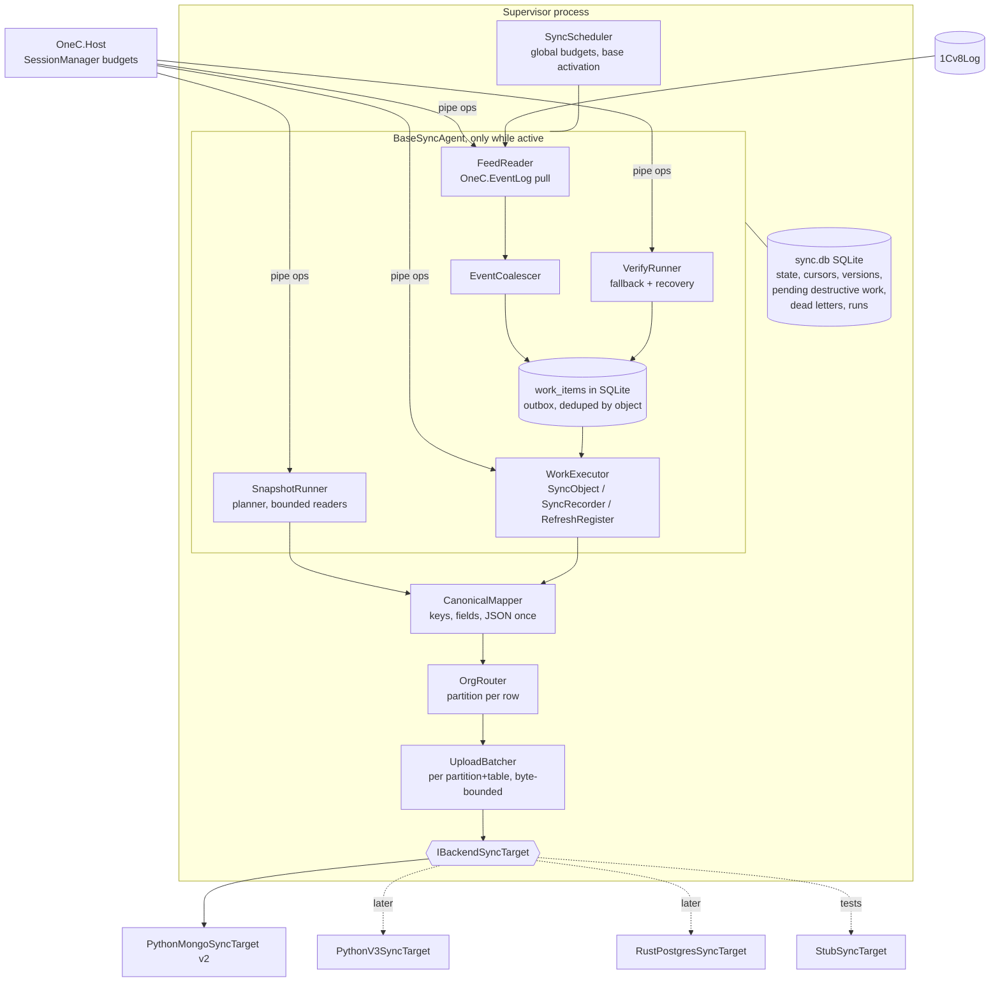
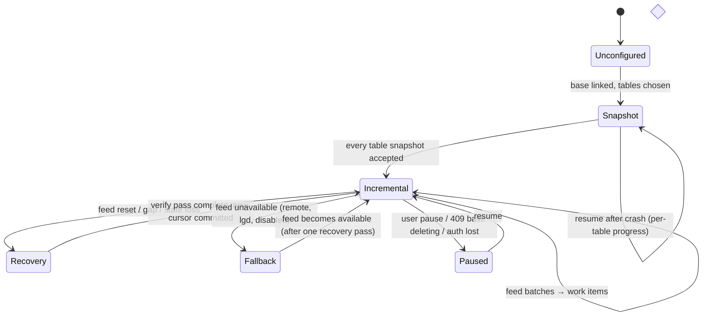
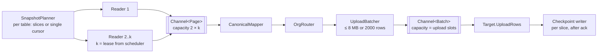
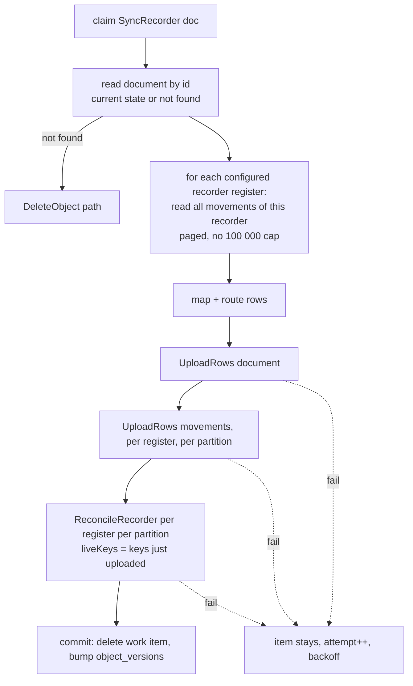
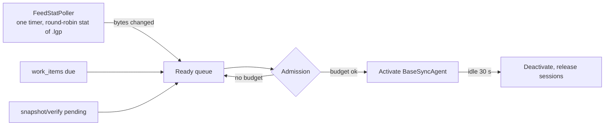
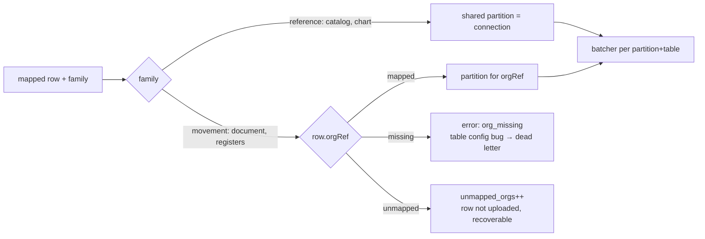

# Sync engine — architecture

Naming (2026-10-02, D48): this engine was built as "Sync Engine v2" beside the milestone 5.9 engine;
that engine is deleted and this one is now simply "Sync" (`src/OneC.Sync`, `/v1/sync/*`,
`--sync-config`). Below, "v2" / "v3" mean the **backend protocol** (Python `/api/v2`, proposed `/api/v3`)
unless a passage says otherwise.

Status: **DESIGN, not implemented.** Date 2026-09-30. Evidence base: `SYNC_ARCHITECTURE_AUDIT.md` (referred to as *the audit*; finding ids F*, RS-*, B-*, R-* are from it).

Nothing in this document has been built or run. Claims about the existing code cite it; claims about how 1C behaves that were **not** verified are marked **VERIFY** and have a spike block in the implementation plan. **Built 2026-09-30 through S15 on local bases, the stub and an isolated local backend/1c** (`src/OneC.SyncState`, `OneC.Sync.Abstractions`, `OneC.Sync.Stub`, `OneC.Sync.Targets.Python`, `OneC.Sync`; status in `MIGRATION_STATUS.md`); changes the build forced on this design are in `DECISIONS.md` D43/D44 (versions read with the row, `seen_run` instead of a sorted merge, work-item generations, a start-up feed drain, outages waiting in the queue, Recovery → Snapshot after a mid-copy reset, backend/1c's own movement classification). **S0 ran 2026-09-30** (`research/sync-spikes/S0-RESULTS.md`): every VERIFY below is answered, marked **S0 ✓**; none contradicted the design.

---

# 1. Goals / Non-Goals

**Goals**

1. Correct incremental sync driven by the 1C event log: every change reaches the backend, every delete is explicit, post/unpost/repost never leaves stale movements.
2. Near-zero idle cost: 30 configured bases that change nothing cost a few `stat` calls per minute, no 1C sessions, no HTTP.
3. Bounded RAM and bounded queues everywhere; a slow or absent backend slows 1C reads, it never grows memory.
4. Durable, transactional, versioned local state (SQLite). Crash at any instant loses no committed intent and never silently jumps a cursor.
5. One base's poison object or broken table cannot stall the base, and never silently drops destructive work.
6. Backend portability: the engine speaks canonical operations; the Python/Mongo `backend/1c` target is first, a Rust/Postgres target later, a cleaner v3 protocol optional.
7. Organisation routing as a pipeline stage, never a silent drop.
8. Observability that the WinUI Sync screen can show directly.

**Non-goals (for this engine)**

- Reproducing the old Connector's sync internals (count gate, sweeps, gap guard, backfill slices, lanes, watchdogs, `localStorage`).
- Writing to 1C (writes stay in the existing write path; sync only *reacts* to them through the feed).
- Bank data, 1UZ, OData/web bases (not COM-reachable today).
- Implementing the Rust target or the Python v3 endpoints (designed here, built only on approval).
- Running old and new connectors on the same base at the same time (see §30, decision D-1).

---

# 2. Required semantics

Distilled from the audit §23. These are the contract; everything else in this document is how the engine honours them.

| # | Semantic | Source of the requirement |
|---|---|---|
| RS1 | Every row has a **stable, deterministic key**: GUID for catalogs/documents, `code` for charts of accounts, `recorderRef#lineNo` for recorder-subordinate registers, a metadata-derived natural key for independent information registers. Never a document number, never a content hash when a key exists. | backend upsert by `rowKey` (audit §8); F5, R-3 |
| RS2 | Upsert by key is idempotent; delivery is at-least-once; **the engine must never let an older state of a key reach the backend after a newer one.** | backend is last-writer-wins, no version guard (audit §16) |
| RS3 | Deletes are explicit: physical delete → prune key; register rows no longer produced by a recorder → reconcile that recorder with its complete live key set. `posted`, `deletionMark`, `Активность` are **fields**, not deletes. | audit §9 |
| RS4 | A document's movements always follow its current posting state, including **changed amounts on unchanged keys**. | F1, F2 |
| RS5 | Movement rows go to the partition of their `orgRef`; reference rows to the shared partition; an unmapped org is visible, never silently dropped; every movement table carries `orgRef`. | audit §11, RS-3 |
| RS6 | Checkpoint only after the backend accepted the work. Take the feed position **before** a cold read and replay after it. A feed gap means recovery, never a silent skip. | audit §5, §7 |
| RS7 | v2-legacy batch shape: multipart `oneCId` + UTF-8 JSON `{table:[rows]}`, rows are dicts with `__rowKey`, ≤ 34 MB, keys unique within a batch. 5xx/413 retryable, 400/409 not (409 = base being deleted: stop). | audit §10 |
| RS8 | References before dependents where the backend or readers care (catalogs, then documents, then movements), or tolerate the gap. | audit §4 |
| RS9 | `userId` sent equals the JWT `sub`; the target partition is the right `(companyId, odataName, name)`. | D41, audit §10 |

---

# 3. High-level architecture



Principles:

- **One process owns sync**: the Supervisor. The desktop app starts/stops it and reads status over the existing edge (`/v1/sync/*`). No sync logic in the UI.
- **The feed is the only change detector in normal operation.** No counts, sweeps, hash maps.
- **The work queue is durable and deduped.** Advancing the feed cursor and inserting the resulting work items happen in **one SQLite transaction** (transactional outbox). After that, the cursor can never outrun the work it produced; work items are executed, retried, or dead-lettered independently.
- **Work items carry intent, not data.** "Sync document X" re-reads X at execution time, so a retry can never upload an older state than 1C has now (RS2).
- **Two modes, separate code paths**: Snapshot (cold/rebuild/recovery) and Incremental (feed → work). The only shared state is the per-base `mode` and the feed cursor handshake (§11).

Per-base mode machine (small by design; the complexity lives in the queues, not in states):



(`Paused` is also entered by the scheduler for resource reasons; it keeps all state.)

---

# 4. Snapshot pipeline

Used for first sync, explicit rebuild of a table, feed reset recovery **only when the verify pass (§12) cannot be used**, and adding a table later.



**Planner.**
- Catalogs and charts: one keyset walk by `Ссылка` (charts by `code` once a chart op exists). No slicing: catalogs are small relative to registers, and keyset is already fast (3.4 k rows/s measured).
- Documents: date-cursor walk; slicing by `Дата` via `SlicePlanner` **only on server bases** and only when the table's estimated rows exceed a threshold (default 200 000).
- Registers: accounting and accumulation by `Период` via `SlicePlanner` (measured 593 → 1 737 rows/s at K = 1 → 4 on KAN); information registers keyed by their natural key (§8) with a keyset walk when non-periodic (fixes R-2).
- File bases: **never sliced** (K = 1). A file base's second session costs ~206 MB and competes with the user; the measured gains were on the server base.
- Slices are persisted (`snapshot_slices`) with `(from, to, cursor, skip, done)`, so a crash resumes each slice from its last accepted page.

**Readers.** Each reader holds one session lease from the scheduler, reads 500-row pages (configurable, capped by a per-page byte ceiling measured on the first page), and `await`s the bounded channel. When the channel is full the reader blocks, and so does its 1C session, which is the intended backpressure (it releases nothing, but it also allocates nothing more).

**Mapper, router, batcher.** See §7–8 (keys), §21 (routing). The batcher packs rows per `(partition, table)` into batches bounded by bytes and rows, **dedupes keys within a batch** (last wins; RS7 says the backend keeps the first, so the batcher must never send duplicates), serialises JSON **once** (no size-probe stringify), and hands the batch to the upload channel.

**Checkpoint.** After the target acknowledges every batch produced from a page, that page's cursor is written to `snapshot_slices` in a SQLite transaction. Out-of-order acks across batches are handled by a per-slice watermark: a slice's cursor only advances to the highest page all of whose batches are acked.

**Why this is fast and bounded.** Read and upload overlap (channels), 1C parallelism only where it was measured to pay, one JSON serialisation per row, no whole-table buffers. Worst-case memory is the channel capacities times the page/batch ceilings (§15).

---

# 5. Incremental pipeline

```mermaid
sequenceDiagram
  participant S as Scheduler
  participant F as FeedReader
  participant C as Coalescer
  participant DB as sync.db
  participant X as WorkExecutor
  participant H as OneC.Host
  participant T as Target
  S->>F: base has new log bytes (stat gate)
  F->>F: read events after cursor (≤ 8 MB)
  F->>C: raw events
  C->>DB: BEGIN; upsert work_items (dedupe by object); set feed_cursor; COMMIT
  S->>X: work available, lease granted
  X->>DB: claim next item (lease, attempt++)
  X->>H: read object / recorder movements (current state)
  X->>T: UploadRows / ReconcileRecorder / DeleteRows
  T-->>X: ack (per-row results where supported)
  X->>DB: BEGIN; delete work_item or record failure/backoff; bump object_versions; COMMIT
```

Rules:

1. **Feed read is cheap and gated.** The scheduler polls `stat` (size, mtime) of the newest `.lgp` per base every `feedPollSeconds` (default 5 s for bases with recent activity, backing off to 60 s after an hour of silence). No bytes changed → nothing happens. This replaces the old per-base 60 s full sync.
2. **Only events for configured tables become work.** Everything else only advances the cursor.
3. **Work items are keyed by object**, so re-queuing an object that is already pending merges instead of duplicating (§6).
4. **Backpressure on the feed**: if the base has more than `maxPendingWork` (default 10 000) items, the feed reader stops reading until the executor drains below a low-water mark. The cursor stays where it is; the log file keeps the events. Nothing is held in RAM.
5. **Ordering**: items for the same object are never executed concurrently (claim uses the object key). Across objects, a base executes at most `incrementalParallelism` items at once (default 1 for file bases, 2 for server bases). Recorder items are ordered after the catalog items they reference only in the weak sense of RS8: catalogs are executed first within a claim round, which is enough because readers tolerate a missing reference for seconds.

---

# 6. Event coalescing

Input: the batch of raw events from one feed read (≤ 8 MB, typically a few hundred events). Output: work items.

**Per object, fold all events in the batch into flags:**

| Event kind (1C) | Effect on the object's flags |
|---|---|
| `New`, `Update` | `changed = true` |
| `Post`, `Unpost` | `changed = true`, `movementsChanged = true` |
| `Delete` | `deleted = true` (supersedes `changed`) |
| register event with recorder ref (accounting, accumulation, calculation and recorder-subordinate information registers: `{"R", type:ref}` — **S0 ✓**, always paired with a document event for the same ref in the same transaction on KAN/bilim; `TotalsMaxPeriodUpdate` `{"D",…}` is not a data change) | on the **recorder** object: `movementsChanged = true` (even if the document type is not configured — fixes R-9) |
| register event with **no** ref (independent info registers, record-set writes) | table-level: `registerRefresh(table) = true` |
| transaction later marked rolled back (D36 marker logic) | event dropped |

**Then map flags to one work item per object:**

| Flags | Work item |
|---|---|
| document `deleted` | `DeleteObject(doc)` → prune key **and** reconcile every configured recorder register with an empty live set |
| document `changed` (no movement flag) | `SyncObject(doc)` |
| document `movementsChanged` (with or without `changed`) | `SyncRecorder(doc)` (reads the document **and** its movements once; §9) |
| catalog `changed` | `SyncObject(catalog item)` |
| catalog `deleted` | `DeleteObject(catalog item)` |
| table `registerRefresh` | one `RefreshRegister(table)` item per table per batch (§8, §12) |

**Merging with already-pending items** (the item is still in `work_items`): flags are OR-ed, `deleted` wins over `changed`, but a later `New` after `Delete` of the **same GUID** (restore from trash is impossible in 1C, but a re-created object with a supplied GUID is) becomes `changed` again. Because every item re-reads 1C at execution time, merging can only lose *redundant* reads, never state.

**Where ordering matters and how it is preserved:**
- Delete-then-recreate of one key: resolved by the re-read (it exists → upsert; missing → prune).
- Repost A then repost B of one document: the item runs once, reads the final state, reconciles once. Correct because reconcile uses the complete current live set.
- Document deleted while its `SyncRecorder` is in flight: the in-flight item finishes with the state it read; the new `DeleteObject` merges into a fresh item that is claimable only after the in-flight one releases the object lock. The last execution wins, and it reflects 1C's latest state.
- The cursor is committed with the items, so ordering across batches is preserved by the queue (FIFO by `first_seen_seq` within the same priority).

**No-op suppression (optional, cheap):** for catalogs and documents the executor can read `ВерсияДанных` with the object (**S0 ✓** selectable on 8.3.15 and 8.3.18; every write bumps it, even one that changes nothing); if it equals `object_versions.data_version`, the upload is skipped. This replaces row hashing for the common "Update event but nothing we sync changed" case.

---

# 7. Row identity

| Family | Key (`__rowKey`) | Notes |
|---|---|---|
| Catalog | lower-case GUID of `Ссылка` | canonical case fixed here; old rows use the GUID as sent by the adapter (**VERIFY** case of existing cloud rows before cut-over, §27) |
| Document | lower-case GUID | same |
| Chart of accounts | `code` | requires a chart read op (missing today); `code` changes are rare and handled as delete + insert |
| Recorder-subordinate register (accounting, accumulation, recorder-subordinate information) | `recorderGuid#lineNo` | `lineNo` = `НомерСтроки`; **accumulation and information rows must emit `recorderRef` and `lineNo`** (today only accounting does: `RegisterReadService.cs:216-227`) |
| Independent information register | natural key, §8 | from metadata, deterministic |
| Stock snapshot (if kept) | n/a | replace semantics |

The mapper also stamps `__rowHash` only when the target wants it (v2 stores it; the engine does not use it for change detection).

**Canonical JSON.** One writer (the existing `JsJson`, JavaScript-compatible numbers) produces the upload bytes **and** the optional hash in the same pass. No second serialisation for size: the batcher counts bytes from the writer.

---

# 8. Register identity

Register families, decided from metadata the host already reads (`RegisterSchema.Periodic`, `Recorded`) plus two properties it must add: the list of **dimensions** (`Измерения`) and the information register's **write mode** (`РежимЗаписи`: independent vs subordinate to recorder) and **periodicity**.

| Family | How it is written in 1C | Key | Incremental trigger | Reconcile |
|---|---|---|---|---|
| Accounting register | by recorder | `recorderGuid#lineNo` | recorder's Post/Unpost/Delete, or a register event with the recorder ref | `ReconcileRecorder(recorder, liveKeys)` |
| Accumulation register | by recorder | `recorderGuid#lineNo` (new: emit both fields) | same | same |
| Information register, **subordinate to recorder** | by recorder | `recorderGuid#lineNo` | same | same |
| Information register, **independent, periodic** | record sets keyed by (`Период`, dimensions) | `p:<Период ISO>|<dim1>|<dim2>…` where each dimension is its canonical value (GUID lower-case for references, ISO for dates, invariant text for strings/numbers, `""` for empty) | table-level event (no ref) | table-scoped refresh (below) |
| Information register, **independent, non-periodic** | record sets keyed by dimensions | `<dim1>|<dim2>…` | table-level event | table-scoped refresh |

The natural key is **not a content hash**: it only includes the dimensions, which 1C itself guarantees unique per (period, dimensions) in an independent register. If a key would exceed a length limit (many dimensions, long strings), the mapper uses `sha256` **of the key string only** (still deterministic and identity-only), with the raw dimensions kept in the row.

**Why independent information registers need a different incremental path.** Their log events carry no object ref (audit §7.4), so the feed says *which register* changed, not *which rows*. Options, compared:

| Option | Correctness | 1C load | Network | RAM | Complexity |
|---|---|---|---|---|---|
| Reset the table (current rewrite, R-1) | correct | full re-read on every change | full re-upload | bounded | trivial, **unacceptable on busy registers** |
| Read the event's `Данные` / `Представление` fields for dimension values | **S0 ✓ not possible**: independent information registers log `{"U"}` (no key, no dimensions) | minimal | minimal | tiny | medium |
| Key-and-version scan: read keys + a narrow projection, diff against local `register_rows` (key → row hash) | correct | one narrow scan per refresh, coalesced | only changed rows | streaming merge, O(1) RAM | medium |

The engine uses the **key-and-version scan**, coalesced per table (at most one refresh per table per `registerRefreshMinSeconds`, default 60 s, and never while one is running), with the per-table local store `register_rows(table, key, row_hash)` on disk. This is the only place the engine keeps row hashes, and only for independent information registers, because they are the only family with no object version and no recorder. If the spike shows the log's event data identifies record-set dimensions reliably, the refresh narrows to those keys (plan block S9).

Tables above a size threshold (default 500 000 rows) are flagged in the UI and default to a longer refresh interval; the developer decides per table (decision D-6).

---

# 9. Post / Unpost / Repost — `SyncRecorder`

One canonical operation per document. It is the only code path that writes movements.



Properties:

- **Completeness**: movements are paged until the read reports no more (fixes R-8), so `liveKeys` is the full set.
- **Amounts on unchanged keys are fixed** because the movements are always re-uploaded, not diffed by key (fixes F1).
- **All configured recorder registers are reconciled**, regardless of lanes or night windows (fixes F2); a register that is disabled for sync is simply not configured.
- **Order**: document first, then movements, then reconcile. If the process crashes anywhere, the item is still in `work_items` and the whole operation re-runs from the start; every step is idempotent (upsert by key; reconcile with the current live set).
- **Partial states visible to readers** (document updated, movements not yet) last only for the duration of one item and are corrected by its completion or retry. The v3 protocol (§19) removes this window with an atomic recorder call.
- **Unposted document**: movements read returns nothing → reconcile with an empty live set deletes the recorder's movements; the document row keeps `posted:false`.
- **Deletion-marked document**: is still a document; if 1C unposted it, the same happens as above; the row keeps `deletionMark:true`.
- **Multi-org**: a document and its movements normally share one `orgRef`. If a document's org changes, reconcile must run for the **old** partition too. The executor keeps `object_partitions(object, partition)` and reconciles every partition the recorder was ever uploaded to (with an empty set for the ones it left).

---

# 10. Deletes

| 1C state | What the engine does | Backend call |
|---|---|---|
| Physical delete of a document/catalog item (event `Delete`, or by-id read returns *definitely not found*) | `DeleteObject`: prune key; for documents, reconcile all configured recorder registers with an empty set in every partition the object used | `DeleteRows`, `ReconcileRecorder` |
| Deletion mark set/cleared | upsert the row with the flag | `UploadRows` |
| Unpost | `SyncRecorder` (movements removed by reconcile) | `UploadRows` + `ReconcileRecorder` |
| Repost | `SyncRecorder` (new movements uploaded, missing lines removed, changed amounts overwritten) | same |
| Register row removed with no recorder (independent info register) | refresh diff finds the key missing | `DeleteRows` |
| Table removed from sync config | nothing deleted in the cloud unless the user explicitly asks "remove table data" | explicit only |

**"Definitely not found" vs "unknown".** A by-id read that fails because the *table* is missing or the host is down is **not** a delete (fixes the P6 hazard where `CatalogByIdAsync` returns null on any NotFound). The host op must distinguish `object_not_found` from `metadata_not_found` and errors; only the first may produce a delete.

**Destructive work is never skipped.** Deletes and reconciles live in `work_items` like everything else; the cursor was already committed with them, so a failure keeps the item, not the cursor, pinned. A delete the backend refuses on policy (v2 `prune-missing` 5 % cap, or 409 on an empty stored table) becomes a **dead letter of kind `needs_approval`**: visible in the UI with the key count, never retried automatically, executed only after the user confirms (which lets the target split it into cap-sized calls).

---

# 11. Feed cursor / recovery

Cursor = `lgfGuid|file|offset` (existing `LogCursor`). Stored in `feed_cursors`, written only inside the same transaction as the work items it produced.

**First sync handshake (RS6):**

```mermaid
sequenceDiagram
  participant E as Engine
  participant L as Log
  participant DB as sync.db
  E->>L: tail position P0 (must exist; see below)
  E->>DB: feed_cursor = P0, mode = Snapshot, snapshot_started_at
  E->>E: snapshot every table (checkpointed per slice)
  Note over E,L: changes during the snapshot are in the log after P0
  E->>DB: mode = Incremental
  E->>L: read from P0: events become work items (re-read current state)
```

- **No log files yet** (brand-new base, nothing logged): the engine creates no cursor and **does not start the snapshot** until the first `.lgp` exists, or it records `P0 = (lgfGuid, first file name expected, 0)` if the reader can express "start of the first file" (**S0 ✓** not today; S6 adds a start cursor `LgfGuid` + empty file; closes the R-8/§5 edge case). An infobase restore (`_$InfoBase$_.RestoreFinish` in the log) is treated as a reset → Recovery. If neither is possible within `feedWaitMinutes`, the base goes to Fallback.
- **Long snapshots vs log retention.** Before starting, the planner estimates snapshot duration (rows ÷ measured rate) and (**S0 ✓**: 8.3's log has no automatic retention and its setting is not readable without admin rights, so there is nothing to compare against). The engine therefore always drains the feed **during** the snapshot into `work_items` (bounded by `maxPendingWork`; excess forces a smaller feed read later, not a loss) so the cursor keeps moving and never points at a deleted file.

**Reset / gap handling (never silent):**

| Reader reports | Engine action |
|---|---|
| `log_recreated`, `cursor_file_gone`, `log_truncated` | mode = Recovery; new cursor candidate = current tail; run the **verify pass** (§12) for every configured table; commit the new cursor only when the verify pass completes |
| `record_over_cap` | log the gap, enqueue a verify pass for the tables named by neighbouring events; cursor moves past the record |
| dictionary race (unknown ids) | re-read the dictionary once and re-parse the same bytes before advancing; only then drop and count |
| feed unreadable (remote server, `.lgd`, access denied) | mode = Fallback (§12) |

State loss (corrupt or missing `sync.db`) is a Recovery, not a cold start: with the backend holding the data, a verify pass (key/version diff) is far cheaper than re-uploading everything.

---

# 12. Fallback mode (and the verify pass it shares with Recovery)

**Needed for:** remote server bases whose log is not on this machine, `.lgd` (SQLite) logs, disabled logs, retention gaps, and Recovery.

**Candidates compared** (for a 1 M-document table with 1 000 changes a day):

| Approach | Detects edits | Detects deletes | 1C load per pass | Network | RAM | Backend load | Complexity |
|---|---|---|---|---|---|---|---|
| Old count gate + cursor + sweeps | partial (F5) | slow, capped | high, many reads | high | high (hash maps) | high (`refhashes` 17 MB) | very high |
| Full re-snapshot | yes | yes (with a keyed diff) | full read | full upload | bounded | full upsert load | low |
| Backend `refhashes` digest compare | yes | yes | full read + hash to compute the same digests | digests + buckets | medium | high (unindexed sort) | high, tied to the Python hash |
| **Local version scan**: `ВЫБРАТЬ Ссылка, ВерсияДанных` ordered by `Ссылка`, merged against local `object_versions` | **yes** (every write changes `ВерсияДанных`) | **yes** (keys missing from the scan) | one narrow index-ordered scan (2 short columns) | only changed objects | O(1) streaming merge | only changed rows | low |

**Decision: fallback = local version scan** for catalogs and documents, driving the same `SyncObject` / `SyncRecorder` / `DeleteObject` work items as the feed. Recorder registers follow their documents (a repost changes the document's `ВерсияДанных`, **S0 ✓**). Independent information registers use the key-and-row-hash refresh of §8. Charts of accounts use a full read (small).

- `object_versions(base, table, key, data_version, seen_run)` lives in SQLite on disk. Measured (S1 StoreBench): ~167 bytes per object → 1 M objects ≈ 160 MB of disk; inserts ~7 800/s, verify stamps ~86 000/s — both above any 1C read rate; this is the price of fallback and recovery. It is populated for free during snapshots and incremental execution (the version comes back with the object read).
- **Cadence**: fallback bases run the scan every `fallbackScanMinutes` (default 15), one table at a time, only when the scheduler has spare budget. Latency is therefore minutes, not seconds, and the UI says so.
- **Verify pass for Recovery** is the same scan run once over every configured table.
- **S0 ✓**: `ВерсияДанных` is readable in queries on 8.3.15/8.3.18, posting/reposting/unposting/marking all change it, and a keyset scan runs at ~9 400 docs/s and ~22 000 catalog rows/s on KAN. If `ВерсияДанных` is not usable, the fallback degrades to a keyed full re-snapshot of the table (correct, just heavier), not to counts and sweeps.

---

# 13. Durable state — SQLite schema

One database per Supervisor: `%LOCALAPPDATA%\AIBA\Connector\sync\sync.db` (never `%TEMP%`). WAL mode, `synchronous=FULL` for the transactions that commit cursors or delete work items, `NORMAL` elsewhere. One writer (the sync subsystem), short transactions.

```sql
-- schema version and migrations
CREATE TABLE meta (key TEXT PRIMARY KEY, value TEXT NOT NULL);           -- schema_version, created_at, app_version

CREATE TABLE sync_bases (
  base_id        TEXT PRIMARY KEY,           -- local infobase name (stable id from bases.json)
  target_kind    TEXT NOT NULL,              -- python-v2 | python-v3 | rust | stub
  connection_id  TEXT NOT NULL,              -- backend partition for shared rows
  company_id     TEXT,
  mode           TEXT NOT NULL,              -- unconfigured|snapshot|incremental|recovery|fallback|paused
  mode_reason    TEXT,
  paused_by_user INTEGER NOT NULL DEFAULT 0,
  config_hash    TEXT NOT NULL,              -- hash of the table config the state belongs to
  updated_at     TEXT NOT NULL
);

CREATE TABLE sync_tables (
  base_id     TEXT NOT NULL,
  table_name  TEXT NOT NULL,                 -- backend table name, e.g. Document_РеализацияТоваровУслуг
  metadata    TEXT NOT NULL,                 -- 1C full name
  family      TEXT NOT NULL,                 -- catalog|document|chart|reg_recorder|reg_info_independent|stock
  key_strategy TEXT NOT NULL,                -- guid|code|recorder_line|natural_key
  enabled     INTEGER NOT NULL,
  PRIMARY KEY (base_id, table_name)
);

CREATE TABLE feed_cursors (
  base_id       TEXT PRIMARY KEY,
  cursor        TEXT,                        -- lgfGuid|file|offset; NULL only before P0
  cursor_at     TEXT,
  last_event_at TEXT,
  log_path      TEXT,
  last_reset_reason TEXT
);

CREATE TABLE snapshot_slices (
  base_id     TEXT NOT NULL,
  table_name  TEXT NOT NULL,
  slice_no    INTEGER NOT NULL,
  from_value  TEXT, to_value TEXT,           -- dates or keys
  cursor      TEXT, cursor_skip INTEGER,     -- last accepted page
  rows_done   INTEGER NOT NULL DEFAULT 0,
  done        INTEGER NOT NULL DEFAULT 0,
  run_id      INTEGER NOT NULL,
  PRIMARY KEY (base_id, table_name, run_id, slice_no)
);

CREATE TABLE work_items (                    -- the durable, deduped outbox
  id            INTEGER PRIMARY KEY,
  base_id       TEXT NOT NULL,
  kind          TEXT NOT NULL,               -- sync_object|sync_recorder|delete_object|refresh_register|verify_table|approved_delete
  table_name    TEXT NOT NULL,
  object_key    TEXT NOT NULL,               -- GUID or table name for table-level work
  flags         INTEGER NOT NULL,            -- changed|movements|deleted bitmask
  priority      INTEGER NOT NULL,            -- 0 destructive/recorder … 9 verify
  first_seen_seq INTEGER NOT NULL,           -- feed order for FIFO
  attempts      INTEGER NOT NULL DEFAULT 0,
  next_attempt_at TEXT,
  lease_until   TEXT,                        -- claimed by an executor
  last_error    TEXT,
  UNIQUE (base_id, table_name, object_key)   -- dedupe: merges instead of duplicating
);

CREATE TABLE object_versions (               -- filled by reads; used by no-op suppression, fallback, recovery
  base_id TEXT NOT NULL, table_name TEXT NOT NULL, object_key TEXT NOT NULL,
  data_version TEXT, synced_at TEXT NOT NULL,
  PRIMARY KEY (base_id, table_name, object_key)
) WITHOUT ROWID;

CREATE TABLE object_partitions (             -- where an object's rows were uploaded (org routing history)
  base_id TEXT NOT NULL, object_key TEXT NOT NULL, partition_id TEXT NOT NULL,
  PRIMARY KEY (base_id, object_key, partition_id)
) WITHOUT ROWID;

CREATE TABLE register_rows (                 -- only independent information registers
  base_id TEXT NOT NULL, table_name TEXT NOT NULL, row_key TEXT NOT NULL, row_hash TEXT NOT NULL,
  PRIMARY KEY (base_id, table_name, row_key)
) WITHOUT ROWID;

CREATE TABLE dead_letters (
  id INTEGER PRIMARY KEY,
  base_id TEXT NOT NULL, work_kind TEXT NOT NULL, table_name TEXT NOT NULL, object_key TEXT NOT NULL,
  category TEXT NOT NULL,                    -- transient_exhausted|validation|missing_config|unmapped_org|needs_approval|backend_bug
  error TEXT NOT NULL, http_status INTEGER,
  attempts INTEGER NOT NULL, first_failed_at TEXT NOT NULL, last_failed_at TEXT NOT NULL,
  next_retry_at TEXT,                        -- NULL = manual only
  payload_hint TEXT                          -- e.g. key count for needs_approval
);

CREATE TABLE unmapped_orgs (
  base_id TEXT NOT NULL, org_ref TEXT NOT NULL, table_name TEXT NOT NULL,
  rows_seen INTEGER NOT NULL, first_seen_at TEXT NOT NULL, last_seen_at TEXT NOT NULL,
  PRIMARY KEY (base_id, org_ref, table_name)
);

CREATE TABLE sync_runs (                     -- history for UI and diagnostics, pruned to N days
  id INTEGER PRIMARY KEY, base_id TEXT NOT NULL, kind TEXT NOT NULL,
  started_at TEXT NOT NULL, finished_at TEXT, outcome TEXT,
  rows_read INTEGER, rows_uploaded INTEGER, bytes_uploaded INTEGER, error TEXT
);
```

**As built in S1** (`src/OneC.SyncState/Migrations/0001_initial.sql`), three changes to the draft above: `work_items.generation` (bumped by every merge; completing or dead-lettering an item that was merged into while it ran releases it for another run instead of deleting it — a delete arriving mid-run is never lost); `work_items.id` is the FIFO order (a merge keeps the row), replacing `first_seen_seq`; `object_versions.seen_run` and `register_rows.seen_run` (the verify pass / refresh stamps every key 1C still has; older stamps are gone objects — 1C orders refs by its own byte order, so a sorted streaming merge against GUID text would be wrong). Page cache 32 MB (the §15 budget).

**Atomicity rules.**
- Feed cursor advance and work-item inserts: one transaction.
- Work-item completion and `object_versions` update: one transaction.
- Snapshot slice checkpoint: one transaction per accepted page.
- Mode transitions: one transaction, together with the cursor when relevant.

**Versioning.** `meta.schema_version`; migrations run forward on start inside a transaction; unknown newer version → the engine refuses to run (read-only status) instead of guessing.

**Corruption.** On open: `PRAGMA quick_check`. On failure: move the file aside (`sync.db.corrupt-<ts>`), create a new one, put every base in **Recovery** (verify pass), never "start from tail". The same happens if the file is missing but the backend reports existing data for the base.

**What is *not* stored.** Credentials (stay DPAPI in `bases.json`), rows, pages, or hash maps of anything except independent information registers.

---

# 14. Scheduler

One global `SyncScheduler` in the Supervisor. A base is **active** only when it has something to do; inactive bases hold no sessions, no tasks, no timers except the shared feed-stat poller.



**Admission** checks, in order:
1. `maxActiveBases` (default 3; a 16 GB client keeps it ≤ 4).
2. Session budget: sync leases come from the host's `SessionManager` but through a **sync class** capped at `syncSessionsPerBase` (file base 1, server base `MaxConcurrency − 1`, so the user always has one) and `syncSessionsGlobal` (default `GlobalMaxSessions − 2`).
3. Memory: host working set + estimated session cost ≤ `MaxWorkingSetMb` (the existing check in `SessionManager.cs:463-478`), plus the sync process's own buffered bytes ≤ `syncBufferedBytesMax`.
4. Upload budget: global in-flight uploads ≤ `uploadConcurrency` (default 4) and in-flight bytes ≤ 64 MB.
5. Foreground: if a user read or a write is waiting on the same base's pool, sync leases on that base are paused (readers finish their current page and stop). Writes also raise a per-base `write_quiet_until` window (default 5 s) during which the executor does not start new items; the feed will deliver the write's own events afterwards.

**Priority** (highest first): destructive and recorder work items → other incremental items → recovery verify → fallback scans → snapshots. Cold snapshots only get what is left, so a first sync never starves daily incremental work on other bases.

**Fairness.** Round-robin across ready bases at each priority; a base yields after `maxSliceSeconds` (default 30 s) of continuous work so one big base cannot monopolise the budget.

**Idle cost.** One timer. Per tick it `stat`s at most `maxStatsPerTick` log files (default 16). 30 idle bases at a 60 s back-off cost 30 `stat` calls per minute and nothing else.

---

# 15. Resource budgets

Defaults sized for a 16 GB client with the measured numbers (server session ~50 MB, first 129 MB; file session ~206 MB; host baseline 35 MB; stack idle 266 MB).

| Budget | Default | Enforced by |
|---|---|---|
| Active bases | 3 | scheduler admission |
| Sync sessions per base | file 1, server `MaxConcurrency − 1` (= 3) | sync lease class |
| Sync sessions global | `GlobalMaxSessions − 2` (= 6) | sync lease class |
| Host working set | `MaxWorkingSetMb` (1 200) per host | existing `SessionManager` check |
| Page channel | 2 × readers pages per table | bounded `Channel<Page>` |
| Page size | 500 rows, shrunk if the first page exceeds 8 MB | reader |
| Upload batch | ≤ 8 MB, ≤ 2 000 rows | batcher |
| Upload concurrency | 4 global, 2 per base | upload channel + semaphore |
| Buffered bytes (pages + batches) | 64 MB global | byte-counting semaphore |
| Pending work items | 10 000 per base (high water), 8 000 (low water) | feed reader stop/go |
| Feed read | 8 MB per call | reader cap |
| Sync process RAM target | ≤ 256 MB above the Supervisor baseline | the sum of the above |

Worst case on a 16 GB client, 3 active server bases each wanting 3 slices: 3 × 3 = 9 sessions are requested, but the global cap (`syncSessionsGlobal` = 6) admits only 6, so 1C sessions ~ 6 × 50 MB (first one 129 MB) + hosts ≈ 0.45 GB; sync buffers ≤ 64 MB; SQLite cache ≤ 32 MB. Well inside budget, and every figure is capped by configuration, not by data size.

---

# 16. Backpressure

Every queue has a capacity, and every producer awaits.

| Queue | Capacity | Producer blocks → effect |
|---|---|---|
| `Channel<Page>` per table | 2 × readers | reader awaits; its 1C session waits (no new pages read) |
| `Channel<Batch>` | upload slots | batcher awaits; mapper awaits; page channel fills; readers block |
| Buffered-bytes semaphore | 64 MB | whoever allocates next waits |
| `work_items` per base | 10 000 rows (on disk) | feed reader stops reading the log; cursor stays; log keeps events |
| Upload retries | per-item backoff up to 5 min | item waits in SQLite, not RAM |

**Slow backend (500 rows/s) vs fast 1C (10 000 rows/s):** readers spend most of their time blocked on the channel; RAM stays at the channel ceilings; sessions are held but not multiplied. The scheduler notices low throughput per session (rows uploaded ÷ lease time) and lowers that base's slice count to 1 to free sessions for other bases.

**Backend down for hours:** uploads fail fast after retries, items move to backoff, snapshot readers stop at the channel, the feed keeps being converted to work items until the high-water mark, then stops. Nothing grows beyond the caps; restart resumes from SQLite.

---

# 17. Backend abstraction

```csharp
public interface IBackendSyncTarget
{
    string Kind { get; }                                   // python-v2 | python-v3 | rust | stub
    Task<TargetCapabilities> GetCapabilitiesAsync(CancellationToken ct);
    Task<SyncConfig> GetSyncConfigAsync(string connectionId, CancellationToken ct);   // tables, org bindings, partitions
    Task<UploadResult> UploadRowsAsync(UploadBatch batch, CancellationToken ct);      // partition, table, rows, batchId
    Task<DeleteResult> DeleteRowsAsync(DeleteBatch batch, CancellationToken ct);      // partition, table, keys, reason
    Task<ReconcileResult> ReconcileRecorderAsync(RecorderReconcile r, CancellationToken ct); // partition, table, recorder, liveKeys
    Task<RecorderSyncResult>? SyncRecorderAtomicAsync(RecorderSync r, CancellationToken ct); // null if not supported (v3 only)
    Task ReportStatusAsync(BaseStatus status, CancellationToken ct);                   // heartbeat, totals, coverage
}
```

- `TargetCapabilities` tells the engine what is possible: per-row results, atomic recorder sync, delete caps, max batch bytes, gzip, version guards. The engine branches **only on capabilities**, never on `Kind`.
- Results are canonical: `accepted`, `rejected[] {key, reason, retryable}`, `http` class (`transient`, `rate_limited`, `auth`, `validation`, `gone`, `policy`). Targets map their quirks to these.
- `StubSyncTarget` replaced the 5.9 engine's `StubBackend` (removed 2026-10-02, D48): implements the same interface in memory, can emulate v2 quirks (first-wins duplicates, 5 % prune cap, swallowed collisions) and v3 guarantees, and records every call for tests.

---

# 18. Python legacy compatibility (`PythonMongoSyncTarget`, v2 endpoints)

What the target must do to honour the canonical semantics on top of v2:

| Canonical op | v2 call | Compatibility handling |
|---|---|---|
| `UploadRows` | `POST /api/v2/entity/upload` multipart | JSON `{table:[rows]}`; `__rowKey` in every row; dedupe keys in the batch (backend keeps the first); ≤ 34 MB, split on 413; **no gzip** (development has none, B-4); map 400 → validation, 409 → `gone` (base deleting: pause the base), 5xx → transient, 401 → refresh token once then `auth` |
| `UploadRows` result | 201 `{results[{inserted,updated,collapsed,skipped}]}` | v2 has no per-row result: treat the batch as accepted as a whole; record `inserted+updated+collapsed+skipped` vs rows sent and flag a **mismatch** metric. The metric is a hint only: a mismatch shows something went wrong, but a **matching total does not prove every row was stored** — the audit showed duplicate-key errors swallowed while inserts are over-reported, so a lost row can hide behind a correct-looking total (known v2 limitation, see below) |
| `DeleteRows` | `POST /api/v1/onec/{id}/prune-missing` | chunk so each call ≤ 5 % of the stored count (from `/counts`); refuse > cap without approval (§10); 409 on empty table → `policy` |
| `ReconcileRecorder` | `POST /api/v1/onec/{id}/reconcile-recorder` | one call per (register, partition); liveKeys are the full set |
| `GetSyncConfig` | `GET /onec?companyId`, `GET /onec/{id}/org-bindings`, `GET /onec/{id}/sync-tables` | builds partitions and routing |
| `ReportStatus` | `PATCH /onec/connection/{id}` | status + `totalCount`; skips when 409 `deleting` |

Auth: the user JWT from `OneC.Cloud` (the desktop's signed-in session), refreshed through `CloudClient` (single-flight refresh). The upload target holds no static token file (fixes R-13). **Known v2 limits the engine cannot fix client-side** (listed so nobody assumes otherwise): concurrent writers to the same key lose silently; inserts can be over-reported; **silent row loss cannot be ruled out on v2** — sent-vs-reported totals catch some losses but a match is not proof of storage (only per-row results in v3, or a read-back count check, can prove it); counts drift; no transaction between document and movements; `rawData.companyId` and `dataHash` are not updated on org remap.

Keys that differ from rows the old Connector stored (accumulation `Регистратор#НомерСтроки` → `recorderGuid#lineNo`; possible GUID case differences): the new engine's first sync of such a table to the v2 backend must be a **table rebuild** (delete the table's rows for that partition, then snapshot). This is destructive and runs only with approval (§27, decision D-3).

**As built, checked against `origin/development` (2026-10-01, D46).** Every prune / reconcile / count goes with `scope=self`: the engine names each partition; backend/1c's `scope=connection` widens a call to every partition of the base keeping only the keys sent, which on a multi-org base deleted the organisations' movements (reproduced on the real server code). Objects whose partition history is unknown are therefore deleted / reconciled in every partition, and a multi-org snapshot records each document's and recorder's partition. Table names are the backend's (`AccountingRegister_Хозрасчетный_RecordType`, `AccumulationRegister_СебестоимостьПродажи_RecordType`; others plain). `sync-tables` answers `[{table, reports}]` or `null` (nothing stored yet ≠ nothing allowed). A 400 "not found" is retried (it is also what a failed Mongo lookup returns); a 409 "being deleted" from a binding is retried (bindings re-read), only the connection's pauses the base; a single row over the edge limit is a dead letter. `/counts` is the backend's counter, not a read-back.

---

# 19. Proposed Python v3 sync API (optional, not built)

Goal: the new Connector gets a protocol whose guarantees match the engine; the old Connector keeps v2.

```
GET  /api/v3/sync/capabilities
     → { version, maxBatchBytes, atomicRecorder: true, perRowResults: true, deleteCaps: {...} }

GET  /api/v3/sync/connections/{connectionId}/config
     → { partitions:[{partitionId, orgRef|null, companyId}], tables:[...], provider }

POST /api/v3/sync/batches                      (idempotent by batchId)
     { batchId, partitionId, table, rows:[{key, sourceVersion, op:"upsert"|"delete", data?}] }
     → { batchId, results:[{key, status:"applied"|"stale"|"rejected", reason?}] }

POST /api/v3/sync/recorders                    (atomic per recorder, idempotent by batchId)
     { batchId, partitionId, recorderKey, sourceVersion,
       document:{table, row}, movements:[{table, rows:[...]}] }
     → replaces the recorder's movements in the listed tables in one transaction

POST /api/v3/sync/tables/{table}/rebuild       (explicit, confirmed by the client)
```

Design points:
- **Explicit keys only**; no content-hash identity; no duplicate drop: duplicates in a batch are a 400 with the keys listed.
- **`sourceVersion`** per row (the object's `ВерсияДанных` plus the feed position, or a monotonically increasing per-base sequence). The backend keeps the last applied version per key and answers `stale` for older ones: fixes last-writer-wins races and stale retries (RS2) for good.
- **Per-row results** so rejected rows become dead letters, not silent drops.
- **Atomic recorder sync** (Mongo transaction needs a replica set: **VERIFY** prod topology; otherwise a two-phase "generation" swap: write new movements tagged with a generation, then flip and delete the old generation).
- **Bounded requests** (published `maxBatchBytes`), gzip supported.
- **Auth**: a connection-scoped device token issued after the user links the base (not the user's day-long JWT), revocable server-side.
- **Capabilities endpoint** lets one client talk to v2, v3 or the Rust service.

---

# 20. Future Rust target

`next-modules/onec` already implements the v2 routes on Postgres with keyed `ON CONFLICT DO UPDATE`, in-batch dedupe, gzip and service-or-JWT auth (audit §10). The Rust target will:
- implement `IBackendSyncTarget` against the v3 semantics (same payloads), so the engine does not change;
- report `atomicRecorder = true` using a Postgres transaction;
- keep integer `oneCId` partitions behind the same `partitionId` string.
Not built yet (block S16, future).

---

# 21. Organisation routing

A pipeline stage between the mapper and the batcher:



- **Which tables are movement tables** is a table-config property (`family`), not a name prefix, so the engine and backend agree explicitly. It must match the backend's `is_movement_table` for the v2 target; the target validates the config against it at start and refuses mismatches.
- **Every movement row must carry `orgRef`.** The host must emit it for accumulation and information registers (today only documents, catalogs with an org attribute, and the accounting register do: audit §11). A movement table whose metadata has no `Организация` is a config error surfaced before sync starts, not at runtime.
- **Unmapped org** (a legal entity in 1C with no binding in the cloud): rows are not uploaded; `unmapped_orgs` counts them; the UI shows "N rows of organisation X are not synced: map it". When a binding appears, the engine enqueues a `verify_table` restricted to that org for each movement table. Nothing is lost because 1C still has the data. **As built (2026-10-01):** while organisations wait, the base is activated every 5 minutes to re-read its bindings; a newly bound one triggers a verify pass over catalogs and documents (their rows kept no version, so they look new) and a fresh copy of every recorded register (lines are found by period, not by object; uploads are idempotent), then its counter is cleared — not restricted to the one org yet.
- **Org change of an object**: see §9 (reconcile the old partition too, from `object_partitions`).
- Single-org bases (no bindings) route everything to the connection partition, as today.

---

# 22. Error / retry / quarantine

Classification (from `IBackendSyncTarget` results and host errors):

| Class | Examples | Handling |
|---|---|---|
| Transient | network, 5xx, timeout, 1C session busy, host restart | per-item exponential backoff (5 s → 5 min, jitter), unlimited attempts but after `maxTransientAttempts` (20) → dead letter `transient_exhausted` with auto-retry every 30 min |
| Rate limited | 429 | honour `Retry-After`; lowers the base's upload concurrency |
| Auth | 401 after one refresh, 403 | base → Paused (`auth`), UI asks to sign in; items keep their place |
| Gone | 409 base deleting | base → Paused (`deleting`), no retries |
| Validation | 400, per-row rejected | dead letter `validation`, no auto-retry; the rest of the batch proceeds |
| Missing config | table missing in 1C (`metadata_not_found`), provider mismatch | the *table* is disabled with a visible error; other tables continue (fixes P7) |
| Unmapped org | §21 | counted, not a dead letter per row |
| Policy | prune over cap, empty-table 409 | dead letter `needs_approval` |
| Backend bug | 500 that repeats identically on the same payload ≥ 5 times | dead letter `backend_bug` with the response body excerpt |

**Rules.**
- A dead-lettered item leaves `work_items`, so the base continues; it never advances anything by itself: the item *is* the pending work.
- **Destructive items** (delete, reconcile, approved delete) are never auto-discarded; they stay as dead letters until retried successfully or explicitly dismissed by the user ("I accept the cloud keeps these rows").
- Manual retry from the UI moves a dead letter back to `work_items` with attempts reset.
- A base whose dead letters exceed a threshold (default 50) shows a warning state but keeps syncing the rest.

---

# 23. Crash / restart semantics

| Crash point | State on disk | On restart |
|---|---|---|
| During feed read, before commit | old cursor, old work items | re-read the same events; coalesced again; idempotent |
| After feed commit | new cursor + work items | executors pick the items up |
| During an item (after some uploads) | item still in `work_items`, lease expired | item re-runs fully; every step idempotent |
| After backend ack, before item delete | item still there | re-runs; re-uploads identical state (idempotent); reconcile with the same live set |
| During snapshot page upload | slice cursor at last fully-acked page | resume the slice from that page |
| SQLite corruption | file quarantined | every base → Recovery verify pass |
| Supervisor killed by the desktop app | same as above | same |

**Shutdown.** The desktop asks the Supervisor to stop; the sync subsystem stops admitting, cancels readers at page boundaries, lets in-flight uploads finish up to 10 s, then cancels. Nothing is committed that was not acked, so a hard kill is equally safe, just slower on restart.

**Can a stale retry overwrite newer data?** Not within one engine: items re-read 1C at execution time, and at most one item per object runs at a time. Across engines (old and new connector on one base) and across backend races: yes on v2, no on v3 (`sourceVersion`).

---

# 24. Observability

Exposed by the Supervisor edge (`GET /v1/sync/status`, `GET /v1/sync/bases/{id}`, `GET /v1/sync/dead-letters`, `POST /v1/sync/bases/{id}/{pause|resume|rebuild|retry}`), and fed to the WinUI Sync screen. As built, the routes are listed in `IPC_CONTRACT.md` (`GET /v1/sync`, `/v1/sync/bases/{b}/…`, `/v1/sync/dead-letters/{id}/…`).

Per base: `mode` (+reason), feed lag (bytes and seconds behind the log tail), snapshot progress (per table rows done / estimated, ETA), rows read / uploaded / bytes uploaded (last hour, total), pending work items by kind, active sessions, retries in backoff, dead letters by category, unmapped orgs, last success time, current table/object, upload mismatch count (v2 hint only: non-zero means loss or over-report; zero does not prove nothing was lost).

Global: active bases, sync RAM (buffered bytes + SQLite cache), 1C sessions held by sync vs foreground, upload concurrency in use, backend latency p50/p95, throughput rows/s in and out, feed polls per minute.

Every mode transition and every dead letter writes a `sync_runs` / log line with the base, table and object. No row content and no tokens are ever logged.

---

# 25. Security

- **Target allow-list**: the Python target only talks to the environment the user is signed in to (`CloudEnvironment` from `OneC.Cloud`); no free-form URL in a config file (fixes R-13). The stub target is only available in test builds or with an explicit developer flag.
- **Tokens**: the user's JWT from the DPAPI session store, refreshed on 401, never written to sync state or logs. v3 proposes a connection-scoped device token.
- **Local store**: `sync.db` holds keys and versions, not row data or credentials; ACL'd to the user profile like the rest of `%LOCALAPPDATA%\AIBA`.
- **Edge**: the sync control routes sit behind the existing loopback-only edge with the `X-AIBA-Token` header. Nothing listens on the LAN (contrast with the old adapter, RS-12).
- **Destructive operations** above policy caps require explicit user approval in the UI.

---

# 26. Performance expectations

Measured baselines (from `DOTNET_REWRITE_PERFORMANCE.md`, local KAN/bilim; re-measure before using as limits):

| Scenario | Expectation | Basis |
|---|---|---|
| Idle, 30 bases, no changes | ≈ 0 % CPU, no 1C sessions, no HTTP; ~30 `stat` per minute | design; no polling of 1C or backend |
| One document posted → cloud | poll interval (≤ 5 s active) + log write delay + ~1–2 s read/upload/reconcile ⇒ **≈ 10 s typical** | old stub run measured 87 s with a 30 s pass interval; the gap is the interval, not the work |
| Event log read | 98 MB/s, 119 MB private | measured |
| Cold catalog | ~2.5–3.4 k rows/s | measured walk |
| Cold documents with tabular sections | limited by 1C rendering (≈ 220 docs/s with sections on KAN) | measured 15 000 docs / 68.7 s |
| Cold accounting register, server base | 537 rows/s at K = 1 → **~1 700 rows/s at K = 4** (≈ 30 min for 3 M rows instead of ~93 min) | measured slices, not yet through sync |
| Recovery after a feed reset (1 M documents, 1 000 changed) | one version scan + 1 000 targeted syncs instead of a 1 M-row re-upload | scan measured in S0: ~9 400 docs/s on KAN ⇒ ~2 min per 1 M-row table |
| Sync RAM | ≤ 256 MB above baseline under full load | budgets §15 |

Upload throughput to the real backend is **unknown** (never measured for either engine). Plan block S12 measures it on dev before any sizing decision.

---

# 27. Migration from the milestone 5.9 engine

The 5.9 engine (then `src/OneC.Sync`) was deleted on 2026-10-02 (D48); this section is the design-time plan.

- **Keep**: `OneC.EventLog` reader (pull design, transaction-aware rollback), `RowIdentity`/`JsJson` canonical JSON, host read ops (catalog keyset, document cursor, register window), `SlicePlanner`, the idea of the tail-first handshake.
- **Replace**: `SyncEngine` (one pass, JSON state, reset-the-table logic), `SyncScheduler` (per-base loops with no global budget), `BaseState` JSON in `%TEMP%`, `IUploadTarget`/`HttpUploadTarget` (static token, no capabilities), `StubBackend` (becomes `StubSyncTarget`).
- **Fix in the host (prerequisites)**: emit `recorderRef` + `lineNo` + `orgRef` for accumulation and information registers; expose register dimensions and write mode; keyset/natural-key paging for non-periodic information registers (R-2); paged by-recorder reads (R-8); distinguish `object_not_found` from `metadata_not_found` (P6); a chart-of-accounts read op; `ВерсияДанных` in object reads and a narrow version-scan op.
- **Cut-over against real data** (decision D-3): tables whose keys change (accumulation registers, any GUID case mismatch) need a per-table rebuild on the backend. Everything else upserts onto the old Connector's rows unchanged (same GUID keys, same row shape per D33).
- **Coexistence** (decision D-1): the new engine refuses to sync a base while the backend reports the old Connector's presence for the same connection. The override is a developer setting for controlled testing only, never a user-facing production switch.

---

# 28. Implementation blocks

Summary; details, tests and stop conditions are in `SYNC_IMPLEMENTATION_PLAN.md`.

| Block | Content |
|---|---|
| S0 | Spikes: `ВерсияДанных` in queries + changes on post/repost; register event data per kind; independent info-register event contents; log retention location; first-file cursor |
| S1 | `sync.db` store (schema, migrations, corruption handling) |
| S2 | `IBackendSyncTarget` + `StubSyncTarget` (v2 and v3 emulation) |
| S3 | Host read prerequisites (keys, orgRef, dimensions, version scan, not-found classes, chart read) |
| S4 | Scheduler + budgets + sync lease class |
| S5 | Snapshot pipeline (channels, batcher, checkpoints, slices) |
| S6 | Feed + coalescer + work queue (transactional outbox) |
| S7 | Incremental executor: `SyncObject`, `DeleteObject` (documents, catalogs) |
| S8 | `SyncRecorder` + reconcile |
| S9 | Registers: accumulation keys, information registers (natural keys, refresh) |
| S10 | Organisation routing |
| S11 | Recovery + fallback (version scan) |
| S12 | Python v2 target (dev backend only) + throughput measurement |
| S13 | Dead letters, approvals, edge control API |
| S14 | WinUI Sync screen |
| S15 | Scale and failure testing |
| S16 | (optional) Python v3 endpoints; (future) Rust target |

---

# 29. Risks / unknowns

| # | Risk / unknown | Impact | Mitigation |
|---|---|---|---|
| K1 | `ВерсияДанных` not queryable or not changed by posting on some platform | fallback and recovery lose their cheap path | **closed by S0**: queryable and bumped by every write on 8.3.15/8.3.18; degrade path kept for unknown platforms |
| K2 | Register events' data does not carry the recorder ref for some kinds | movements changed outside a document go unnoticed until the document changes | **S0**: every recorder-register event carried the recorder ref (15 733/15 733 on KAN, paired with the document event); register events are incomplete, so they stay a secondary trigger beside Post/Unpost/Delete; a null-ref event still means a keyed table verify, never a reset |
| K3 | Independent information registers with millions of rows and frequent writes | refresh cost | per-table interval, S0 measurement, decision D-6 |
| K4 | Log written after commit visibility, or dictionary race | a missed change | dictionary re-read before dropping; periodic lightweight verify for bases with dropped events (metric) |
| K5 | Log retention shorter than a long snapshot | feed reset mid-snapshot | drain feed during snapshot (§11) |
| K6 | v2 backend silent drops / over-reports | data loss on the cloud side that v2 cannot reliably detect (a matching total is not proof) | mismatch metric as a partial hint; periodic count check against `/counts`; v3 per-row results for proof |
| K7 | Old and new connectors on one base | last-writer-wins corruption | D-1: presence check, refuse |
| K8 | Upload throughput of the real backend unknown | cold sync duration, sizing | S12 measurement on dev |
| K9 | Key changes vs rows the old Connector stored | duplicates until rebuild | D-3 rebuild with approval |
| K10 | SQLite on a slow/roaming profile disk | commit latency | WAL, batched transactions; measure in S1 |
| K11 | Mongo prod topology (replica set?) | v3 atomic recorder feasibility | ask backend owner (D-5) |

---

# 30. Developer decisions (decided 2026-09-30)

Recorded in `DECISIONS.md` as D42. These are binding for implementation.

| # | Question | Decision |
|---|---|---|
| D-1 | May the old and new connectors sync the **same** base / `oneCId` at the same time in production? | **No.** Default refuse. A developer override exists for controlled testing only. |
| D-2 | First real target? | **Python backend dev/staging only.** No production sync until S15 is green **and** the developer explicitly approves it. |
| D-3 | Per-table rebuild at cut-over for tables whose canonical row identity changes? | **Yes**, per table, each with explicit confirmation. |
| D-4 | Multi-organisation routing? | **Required before production release.** A single-org pilot may be tested earlier; the engine is not production-ready for general rollout without S10. |
| D-5 | Python v3? | **Python v2 target first.** v3 is approved as a later, separate backend block after the engine is proven on the v2 target. **No Rust target now.** |
| D-6 | Refresh policy for independent information registers | **No hard-coded global interval.** Refresh is configurable per table; defaults are chosen from S0/S9 measurements. 5 min is only an initial candidate for large tables, not a universal policy. |
| D-7 | Chart of accounts, stock snapshot, data coverage | Chart of accounts: **keep.** Stock snapshot and data coverage: keep **only if an active consumer is proven**; never ported only for legacy parity. |
| D-8 | Accounting-register night-only lane; ЧекККМ manual-only | **Drop the night lane.** Incremental accounting movements are event-driven through `SyncRecorder`; cold snapshot work stays under scheduler/resource budgets. ЧекККМ manual-only is kept only if it is a genuine product policy, not a performance workaround (per-table `manual` flag). |
| D-9 | Unauthenticated `backend/1c` routes (B-3) | **Record and report as security bugs.** No production backend change in this project unless separately approved. |

---

# Final review — challenging the design

| Question | Answer | Change made |
|---|---|---|
| Are we rebuilding the old sync? | No counts, sweeps, gap guard, backfill, lanes, watchdogs or `localStorage`. The one per-row store (`register_rows`) is limited to independent information registers, which have no object version and no recorder; `object_versions` is keyed state for fallback/recovery, not a change detector in normal operation. | Restricted `register_rows` to that family explicitly. |
| Is anything unbounded? | Channels, bytes, work items (high/low water), dead letters (count threshold → warning), `sync_runs` (pruned), `object_versions` (bounded by objects in 1C; disk, not RAM). By-recorder reads are paged, not capped. | Added paging for by-recorder reads; added `sync_runs` pruning. |
| Can a crash lose data? | Cursor and work items commit together; items are deleted only after the target acked; snapshots checkpoint per acked page. | — |
| Can a stale retry overwrite newer data? | Not from one engine (re-read at execution, one item per object). Yes across engines/races on v2; v3 `sourceVersion` fixes it. | Made D-1 a hard refusal by default. |
| Can a bad item stall a base? | No: dead letters leave the queue; tables with missing metadata are disabled individually. | — |
| Can a slow backend explode RAM? | No: every queue is bounded; work items live on disk with a high-water stop on the feed. | — |
| Can a long cold sync miss changes? | Tail taken first; feed drained into work items during long snapshots so retention cannot overtake the cursor. | Added the during-snapshot drain (§11). |
| Can a delete be lost? | Deletes are durable work items; policy refusals become `needs_approval`; "not found" is only trusted when it is object-level. | Added the not-found classification requirement. |
| Can a repost leave stale movements? | `SyncRecorder` always re-uploads the full current movement set and reconciles every configured register in every partition the recorder used. | Added `object_partitions` for org changes. |
| Can 30 idle bases consume resources? | One timer and a few `stat` calls; no sessions, tasks or HTTP until the log grows. | — |
| Does it work on a 16 GB client? | Budgets cap sync at 3 active bases, 6 sync sessions, 64 MB buffers, ≤ 256 MB extra RAM. | — |
