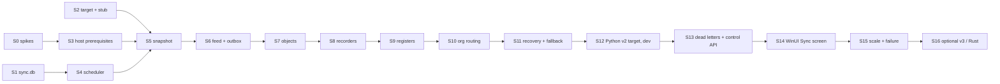

# Sync engine — implementation plan

Companion to `SYNC_ENGINE_ARCHITECTURE.md` (section numbers `§n` refer to it). Architecture approved 2026-09-30; developer decisions D-1..D-9 are in §30 and `DECISIONS.md` D42. Progress is tracked in `MIGRATION_STATUS.md` ("Sync"). Built as "Sync Engine v2"; since 2026-10-02 it is the one canonical engine, `src/OneC.Sync` (D48). "v2" / "v3" below mean the Python backend protocol. Each block is small enough to verify on its own; later blocks only depend on the interfaces of earlier ones.

**Decisions that shape the blocks** (short form; full text in §30)
- D-1: never old + new Connector on the same base in production; default refuse, developer override for controlled tests only (S13).
- D-2: first real backend is Python dev/staging only; no production sync until S15 is green **and** explicitly approved.
- D-3: per-table rebuild at cut-over, each with explicit confirmation (S13/S14).
- D-4: S10 is required before production release; a single-org pilot may run earlier.
- D-5: Python v2 target first; v3 later as a separate approved backend block; no Rust target now.
- D-6: independent-register refresh interval is per table; defaults come from S0/S9 measurements.
- D-7: chart of accounts kept; stock snapshot and data coverage only with a proven active consumer.
- D-8: no night lane; accounting movements via `SyncRecorder`; ЧекККМ `manual` only as a product policy.
- D-9: unauthenticated backend routes recorded as security bugs; no backend change here.

**Rules for every block**
- Build against `StubSyncTarget` and local bases (KAN, bilim, signum, Kanstik). No real cloud until S12, and then **dev only**.
- No test creates, posts or deletes anything in a real client base. Live tests use the test-owned `AIBA_REWRITE_` documents on local bases only, as today.
- Release suite green before a block is called done. Report measured numbers with the command that produced them.
- No commit or push without explicit approval.

Order changed from the suggested shape: a **spike block S0** comes first (several design choices depend on 1C facts not yet verified), and **host prerequisites (S3)** come before the pipelines that need them.

---

## S0 — Spikes (read-only facts the design depends on)

**Goal.** Replace every **VERIFY** in the architecture with a measured answer.

**Questions and method** (all read-only on local bases; any 1C write uses only the existing test-owned `AIBA_REWRITE_` document flow on KAN/bilim):
1. Is `ВерсияДанных` selectable in a query for catalogs and documents (8.3.15 and 8.3.18)? Does it change on post, unpost, repost, deletion mark, and on a write that changes nothing?
2. Speed of `ВЫБРАТЬ Ссылка, ВерсияДанных ИЗ Документ.X УПОРЯДОЧИТЬ ПО Ссылка` on KAN's largest document table and on bilim (file).
3. Event data per register kind in the log: accounting, accumulation, recorder-subordinate information, independent information (periodic and not). Does it carry the recorder ref, the dimensions, or nothing?
4. Does a deletion mark produce an `Update` event? A catalog rename? What do restore/`PredefinedDataInitialization` look like?
5. Where 1C stores log retention for file and server bases; whether it can be read without admin rights.
6. Can a cursor express "start of the first file" when no events exist yet?
7. Case of GUID keys in rows the old Connector stored on dev for one base (read via backend `GET /entity`, dev only, read-only). **Deferred to S12** — needs a dev backend login; it only affects the D-3 rebuild list, not the engine design.

**Files.** `research/sync-spikes/` notes + small host modes (`OneC.Host spike-*`), no production code.
**Dependencies.** none.
**Tests.** none (facts, not features). Each answer recorded with the command and output in `SYNC_ENGINE_ARCHITECTURE.md` §29 and `DECISIONS.md`.
**Live verification.** as above, local bases.
**Performance measurement.** Q2 rows/s and wall time; Q3 event counts per kind over a day of KAN log.
**Stop conditions.** Stop and report if `ВерсияДанных` is unusable (fallback design changes to keyed re-snapshot) or if recorder refs are absent for accumulation registers (incremental design for registers changes).

---

## S1 — Durable state store (`sync.db`)

**Goal.** SQLite store per §13 with migrations, transactions, corruption handling.

**Files.** new `src/OneC.SyncState/` (or `OneC.Sync/State/`): `SyncDb.cs`, `Migrations/0001_initial.sql`, typed repositories (`FeedCursors`, `WorkItems`, `SnapshotSlices`, `ObjectVersions`, `DeadLetters`, `Runs`). Package: `Microsoft.Data.Sqlite`.
**Dependencies.** none.
**Tests (unit).** migrations from empty and from v1; cursor + work-item insert in one transaction (kill between statements via a fault hook → neither visible); work-item dedupe merge of flags; lease expiry; `quick_check` failure → file quarantined and bases marked Recovery; newer schema version → read-only refusal; WAL survives process kill (child process test).
**Live verification.** none.
**Performance.** 10 000 work-item upserts in batches of 500 < 1 s on the dev machine; `object_versions` 1 M rows insert time and file size (feeds the §12 disk estimate).
**Stop conditions.** If commit latency with `synchronous=FULL` exceeds 20 ms p95 on the target machine, stop and revisit batching before S6.

---

## S2 — Backend semantic interface + stub

**Goal.** `IBackendSyncTarget`, canonical result types, `StubSyncTarget` able to emulate **v2 quirks** (first-wins duplicates, 5 % prune cap, swallowed collisions, 409 deleting) and **v3 guarantees** (per-row results, `sourceVersion` stale rejection, atomic recorder).

**Files.** `src/OneC.Sync.Abstractions/` (interface, `UploadBatch`, `RecorderReconcile`, `TargetCapabilities`, results), `src/OneC.Sync.Stub/StubSyncTarget.cs` (replaces the 5.9 engine's `StubBackend.cs`, removed 2026-10-02, D48).
**Dependencies.** none.
**Tests.** contract tests run against the stub in both emulation modes: idempotent re-upload; duplicate key in batch (v2 keeps first / v3 rejects); reconcile with empty and partial live sets; prune over cap; stale `sourceVersion`; capabilities drive behaviour (no `Kind` checks in engine code: an analyzer test greps for it).
**Live verification.** none.
**Performance.** n/a.
**Stop conditions.** none.

---

## S3 — Host read prerequisites

**Goal.** Give the engine what §7–12 require from 1C.

**Changes (in `OneC.Host`):**
1. Accumulation and recorder-subordinate information registers emit `recorderRef`, `lineNo`, `orgRef` (as accounting does, `RegisterReadService.cs:216-231`).
2. `RegisterSchema` gains `Dimensions`, `WriteMode` (independent / subordinate), periodicity.
3. Non-periodic information registers: keyset paging by natural key (fixes R-2's root cause).
4. Stable tie-break for independent periodic information registers (`Период` + dimensions).
5. By-recorder reads paged with `HasMore` (fixes R-8).
6. By-id reads return `object_not_found` vs `metadata_not_found` vs error (fixes P6).
7. Chart-of-accounts page and by-code ops.
8. `ВерсияДанных` in catalog/document object reads; a narrow `versions` op (`Ссылка, ВерсияДанных`, keyset, 5 000 per page) — only if S0 confirms.

**Files.** `RegisterReadService.cs`, `RegisterSchema.cs`, `CatalogReadService.cs`, `DocumentReadService.cs`, new `ChartReadService.cs`, `Operations.cs`, `IPC_CONTRACT.md`.
**Dependencies.** S0.
**Tests.** unit (key building, natural-key canonicalisation incl. empty refs, dates, numbers); live on KAN/bilim: every register kind returns keys; non-periodic info register pages terminate and cover every row exactly once (count vs `COUNT(*)`); by-recorder paging over a synthetic > page recorder (if none exists, a page size of 5 in the test); not-found classes; chart read vs 1C row count; parity tests stay green (row shape unchanged except the added fields, D33).
**Live verification.** KAN (server), bilim (file), 8.3.15 and 8.3.18.
**Performance.** version scan rows/s (from S0) confirmed through the op; register page timings unchanged ±10 %.
**Stop conditions.** Parity drift in existing row shapes → stop; the backend compatibility of the added fields must be confirmed first.

---

## S4 — Scheduler and resource budget

**Goal.** Global `SyncScheduler` (§14–15): feed-stat poller, admission (active bases, sync lease class, working set, upload budget), priorities, fairness, foreground yield, idle deactivation.

**Files.** `src/OneC.Sync/Scheduling/`: `SyncScheduler.cs`, `FeedStatPoller.cs`, `Budgets.cs`; `OneC.Sessions`: a sync lease class (caps per base and global, foreground-preemptible at page boundaries).
**Dependencies.** S1.
**Tests.** unit with a fake clock and fake bases: 30 idle bases → 0 activations, bounded `stat` calls per minute; 30 bases with work → never more than `maxActiveBases`; foreground lease waiting → sync pauses at the next page; priorities (recorder work before snapshots across bases); fairness (no base > `maxSliceSeconds` while others wait).
**Live verification.** Supervisor with 6 local bases, all idle for 10 min: CPU sampled (target ≈ 0 %), no 1C sessions held by sync.
**Performance.** idle CPU and handle count over 10 min; admission latency.
**Stop conditions.** idle CPU measurably above the Supervisor's current idle → stop and fix before S5.

---

## S5 — Cold snapshot pipeline

**Goal.** §4: planner, bounded readers, `Channel<Page>`, mapper (JSON once), batcher (dedupe, byte/row limits), upload channel, per-page checkpoint, slices on server bases.

**Files.** `src/OneC.Sync/Snapshot/`: `SnapshotPlanner.cs`, `SnapshotRunner.cs`, `CanonicalMapper.cs`, `UploadBatcher.cs`; reuse `SlicePlanner` through a new host op if not already exposed.
**Dependencies.** S1, S2, S3, S4.
**Tests.** unit with a fake source: bounded memory (instrumented byte counter never exceeds budget with a slow target), overlap (reads continue while uploads run), out-of-order batch acks → slice watermark correct, crash at every step (fault injection) → resume without loss or duplicate beyond idempotent re-upload, dedupe within batch.
**Live verification.** stub target; KAN: catalogs (ДоговорыКонтрагентов), one document table, Хозрасчетный windowed to 12 months with K = 1 and K = 4; bilim with K = 1.
**Performance.** rows/s per family and K; peak private bytes of the Supervisor; compare with the measured host-only walks (537 / 1 737 rows/s). Target: sync overhead ≤ 15 % over the raw walk at K = 1.
**Stop conditions.** RAM above budget, or overhead > 30 % → stop and profile.

---

## S6 — Event feed, coalescer, durable work queue

**Goal.** §5–6, §11: feed reading gated by the stat poller, coalescing to per-object flags, transactional outbox (cursor + items in one transaction), high/low-water backpressure, first-sync handshake (tail before snapshot), reset handling into Recovery (Recovery itself arrives in S11; until then reset → full snapshot with a visible warning).

**Files.** `src/OneC.Sync/Incremental/`: `FeedReader.cs` (wraps `OneC.EventLog`), `EventCoalescer.cs`, `WorkQueue.cs`.
**Dependencies.** S1, S4, S5.
**Tests.** unit: the coalescing table of §6 (every row), rollback-marked events dropped, dictionary race (unknown id then re-read), high-water stops the reader, cursor never ahead of committed items (fault injection between coalesce and commit), tail-before-snapshot handshake with events written during the snapshot (fake feed).
**Live verification.** KAN: open a real feed, write the test-owned document (existing write test), observe exactly one work item per object after coalescing.
**Performance.** feed → items throughput on a replayed 2 GB KAN log (read-only copy): events/s, items created, RAM.
**Stop conditions.** any case where the cursor can advance past uncommitted items.

---

## S7 — Incremental executor: objects

**Goal.** `SyncObject` and `DeleteObject` for documents and catalogs; lease/claim, per-object exclusion, backoff, no-op suppression by `ВерсияДанных` (if S0 confirms).

**Files.** `src/OneC.Sync/Incremental/WorkExecutor.cs`, `ObjectHandlers.cs`.
**Dependencies.** S6.
**Tests.** unit: one item per object at a time; delete vs not-found classes; retry backoff; item survives crash mid-upload; no-op suppression skips unchanged objects.
**Live verification.** KAN via stub: create/edit/delete the test-owned document; stub state matches 1C after each step.
**Performance.** event-to-stub latency distribution (target p50 ≤ 10 s with a 5 s poll).
**Stop conditions.** latency dominated by something other than the poll interval → profile.

---

## S8 — Recorder / movement reconciliation

**Goal.** `SyncRecorder` (§9): document + all configured recorder registers, paged movements, upload, reconcile per register per partition, `object_partitions` history, single logical unit with retry from the start.

**Files.** `src/OneC.Sync/Incremental/RecorderHandler.cs`.
**Dependencies.** S3, S7.
**Tests.** unit with fake 1C and stub (v2 emulation): post, unpost, repost with fewer lines, repost with **same keys and changed amounts** (F1), document deleted, register not in the document's config (F2), crash between each step, org change of a document (reconcile old partition).
**Live verification.** KAN test-owned document: post → unpost → repost → delete, stub movements equal 1C's `ДвиженияССубконто` for that recorder after each step.
**Performance.** per-recorder latency; calls per post (target: 1 doc read + 1 movements read per register + uploads + reconciles; no table scans).
**Stop conditions.** any stale movement left in the stub after a step.

---

## S9 — Information and accumulation registers

**Goal.** §8: accumulation keys (from S3), recorder-subordinate info registers through `SyncRecorder`, independent info registers with natural keys and coalesced `RefreshRegister` (key + row-hash diff via `register_rows`), per-table refresh interval.

**Files.** `src/OneC.Sync/Incremental/RegisterRefresh.cs`, mapper key strategies.
**Dependencies.** S3, S8.
**Tests.** unit: natural-key determinism, refresh diff (insert/update/delete), coalescing (N events → one refresh), large-table interval; no table reset on events (R-1 regression test).
**Live verification.** bilim `РегистрСведений.СтатусыДокументов` (121 events/day per the audit): one refresh per interval, only changed rows uploaded.
**Performance.** refresh cost per table size (rows scanned/s, rows uploaded).
**Stop conditions.** refresh cost on the biggest local independent register exceeds 10 % of a sync session's time at the candidate interval → bring the numbers to the developer (D-6). The interval is a per-table setting; no global constant.

---

## S10 — Organisation routing

**Goal.** §21: router stage, partition map from `GetSyncConfig`, unmapped-org accounting, org-restricted verify when a binding appears, config validation against backend movement classification.

**Files.** `src/OneC.Sync/Routing/OrgRouter.cs`, `PartitionMap.cs`.
**Dependencies.** S5, S8, S2.
**Tests.** unit: reference vs movement routing, missing `orgRef` on a movement table = config error, unmapped org counted not dropped, org change reconciles old partition, validation mismatch refuses start.
**Live verification.** Kanstik (multi-org per memory) via stub with synthetic bindings: rows land in the right partitions; counts per org equal 1C `COUNT` by `Организация`.
**Performance.** router overhead per row (should be negligible).
**Stop conditions.** any movement row routed to the shared partition.

---

## S11 — Recovery and fallback

**Goal.** §11–12: Recovery mode (verify pass by version scan, then commit new cursor), Fallback mode for bases with no readable feed (periodic version scans), state-loss recovery.

**Files.** `src/OneC.Sync/Verify/VerifyRunner.cs`, `VersionMerge.cs`.
**Dependencies.** S3 (versions op), S7–S10.
**Tests.** unit: streaming merge (changed, missing, new) with O(1) memory; recovery commits the cursor only after completion; fallback cadence respects budgets; corrupt `sync.db` → Recovery, never tail.
**Live verification.** KAN: simulate reset (rename the cursor's file in a **copy** of the log dir via a test hook, not the real log), confirm only changed objects are re-synced; a fake "remote" base forces Fallback.
**Performance.** full verify of KAN's largest document table: wall time, rows/s, 1C load; compare to a full re-snapshot.
**Stop conditions.** version scan slower than a re-snapshot (then fallback uses re-snapshot).

---

## S12 — Python v2 target (dev backend only)

**Goal.** §18: `PythonMongoSyncTarget` over v2 endpoints with `OneC.Cloud` auth (refresh on 401), capabilities for v2, prune chunking under the 5 % cap, mismatch metric, 409 handling.

**Files.** `src/OneC.Sync.Targets.Python/`.
**Dependencies.** S2 contract tests, S7–S10.
**Tests.** the S2 contract suite against a local `backend/1c` docker (dev compose) — not the shared dev server first; then read-only smoke against dev.
**Live verification.** **dev only**, one test company, one small base (e.g. signum), with explicit approval before the first write; compare backend counts to 1C.
**Performance.** upload throughput rows/s and bytes/s against local docker and dev; backend latency p50/p95 — the first real numbers for §26.
**Stop conditions.** any unexplained mismatch between sent and reported rows; any 5xx pattern → stop and report to the backend owner. A matching total is **not** accepted as proof of storage (v2 swallows duplicate-key errors and over-reports inserts): live verification compares backend counts/keys read back against 1C. Before the first write to the shared dev backend: stop for explicit approval (D-2).

**Status 2026-10-01: local complete; shared dev blocked on the developer's dev login + dedicated test company.** Dev approved by the developer after a clean Release gate (met: two consecutive 414/414 runs). Built: the dev target and its guards (D47), `sync-verify` (every stored row read back vs a fresh canonical 1C read), `sync-dev companies / check / create-record`, failure injection, the bilim test-document lifecycle tool; the first-run table set is chart + `Catalog_Банки` (919) + `Document_ПоступлениеТоваровУслуг` (68) + `AccountingRegister_Хозрасчетный` from 2025-08-01 (~49 lines). Contract corrections found by reading `origin/development` (D46): `scope=self`, `sync-tables` shape, backend table names, 400 / 409 / 413 classification. Runbook: `DEV_SYNC_TEST_RUNBOOK.md`. The read-only GUID-case check (S0 Q7) runs with it.

---

## S13 — Dead letters, approvals, control API

**Goal.** §22, §24: dead-letter categories and retry policies, `needs_approval` flow, edge routes (`/v1/sync/status`, `/bases/{id}`, `/dead-letters`, pause/resume/rebuild/retry/approve).

**Files.** `src/OneC.Sync/Errors/`, `src/OneC.Supervisor/EdgeServer.cs` routes, `IPC_CONTRACT.md`.
**Dependencies.** S7–S12.
**Tests.** each error class maps correctly; poison item does not stall the base; destructive dead letters never auto-discard; approval executes a capped delete in chunks.
**Live verification.** stub with injected failures.
**Performance.** n/a.
**Stop conditions.** none.

---

## S14 — WinUI Sync screen and wiring

**Goal.** Desktop starts sync for linked bases (behind a setting, default off until S15), shows per-base state, lag, progress, dead letters, approvals, pause/resume/rebuild.

**Files.** `src/OneC.Desktop/Views/SyncPage.*`, `Controls/…`, Supervisor start args.
**Dependencies.** S13.
**Tests.** UI Automation run against the stub target; visual approval by the developer.
**Live verification.** local bases + stub; later dev target.
**Performance.** UI polling cost negligible (uses status snapshots, patched tables).
**Stop conditions.** developer visual approval required before any commit.

---

## S15 — Scale and failure testing

**Goal.** Prove the final-review claims.

**Scenarios.** 30 configured bases (local copies/aliases), mostly idle: CPU and sessions. 3 bases cold-syncing while 2 receive incremental changes. Backend down for 2 h (stub offline) then back. Slow backend (stub throttled to 500 rows/s) vs fast reads. Supervisor killed at random points 50 times during a snapshot and during incremental work. Corrupt `sync.db`. Feed reset mid-snapshot. 16 GB machine memory ceiling.
**Dependencies.** S14.
**Pass criteria.** idle ≈ 0 % CPU; RAM within §15 budgets; zero lost changes (stub state equals 1C after convergence); zero stale movements; bounded queues; every failure visible in the UI.
**Stop conditions.** any lost change or stale movement → block release.

---

## S16 — Optional: Python v3 endpoints; future: Rust target

**Goal.** Decision D-5: Python v3 is approved as a later, separate backend block once the engine is proven on the v2 target — implement §19 in `backend/1c` (separate repo, its own pipeline and review), then `PythonV3SyncTarget`. The Rust target (`RustPostgresSyncTarget` against `next-modules/onec`) is **not** approved now.
**Dependencies.** S15 green on v2.
**Stop conditions.** backend owner's approval; prod Mongo topology known (replica set for transactions).
