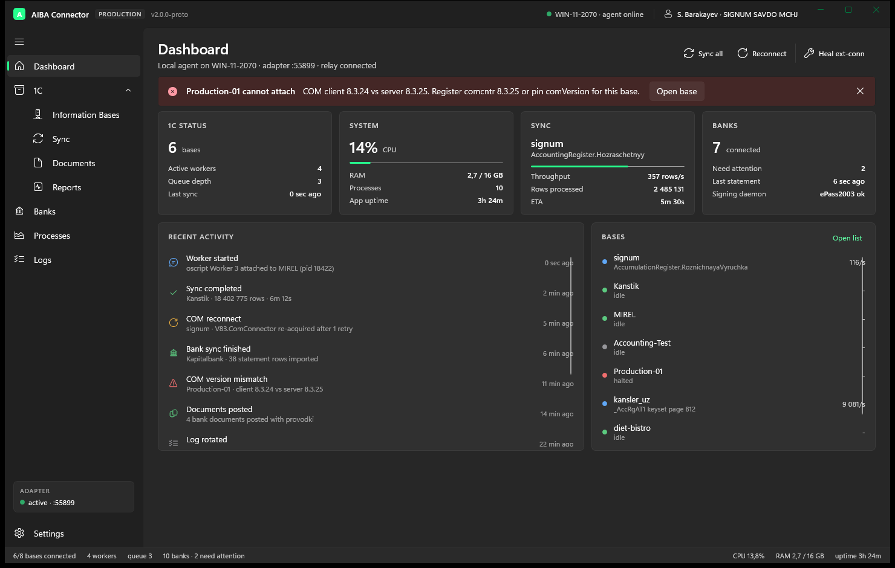

# AIBA Connector — WinUI 3 shell prototype

A throwaway, click-through prototype that answers one question: **what would AIBA Connector
look and feel like if the desktop shell were rebuilt natively on Windows?**

It is a design and architecture study. There is no 1C, no COM, no bank, no oscript, no network.
Every number on screen comes from a mock service driven by a one-second timer.

The production Tauri + React connector in `D:\aiba\connector` is untouched.



---

## Run it

Requirements: Windows 10 1903 or newer, the .NET 9 SDK. Nothing else — the app is published
self-contained and unpackaged, so no Windows App Runtime install and no MSIX signing.

```bash
dotnet build prototypes/winui-aiba-shell/src/AibaShell/AibaShell.csproj -c Debug
```

Then run the produced executable:

```bash
prototypes/winui-aiba-shell/src/AibaShell/bin/Debug/net9.0-windows10.0.19041.0/win-x64/AibaShell.exe
```

`dotnet run --project prototypes/winui-aiba-shell/src/AibaShell/AibaShell.csproj` also works.

### Opening straight on one screen

For screenshots and demos the shell accepts a start page:

```bash
AibaShell.exe --page sync
```

Valid tags: `dashboard`, `bases`, `base`, `sync`, `documents`, `reports`, `banks`,
`processes`, `logs`, `settings`. `base` opens the detail page of the base that is in an
error state, which is the most interesting one to show.

If a page ever fails to appear when you click its nav item, the exception is appended to
`%TEMP%\aibashell-nav-errors.log` — WinUI swallows page-constructor failures otherwise.

---

## What is on screen

| Screen | What it demonstrates |
|---|---|
| **Dashboard** | Fleet health at a glance: 1C, system, the running sync, banks, plus a recent-activity feed and a per-base strip. An `InfoBar` carries the one thing an operator must act on. |
| **1C › Information Bases** | The densest table in the app. Name, type, 1C version, status, worker, COM state, last sync, rows/sec, memory, per-row actions. Filter box plus a `SelectorBar` for All / Connected / Syncing / Problems. |
| **1C › Base detail** | Connection, worker and sync facts for one base, the objects under sync in `Expander`s, and the operator actions in a `CommandBar`. |
| **1C › Sync** | The operations console. One big readout plus four worker lanes, each owning a date slice, with its own throughput. This is the screen that best shows why a native shell is worth it. |
| **1C › Documents** | What this machine wrote into 1C, with the AIBA marker on every row. |
| **1C › Reports** | Declarative reports built from synced data. |
| **Banks** | Card grid, one per bank, with the state that decides whether a human has to act. |
| **Processes** | The process tree — shell, router, four oscript workers, reports, 1UZ adapter, bank connector, SQB automation — with PID, uptime, RAM, CPU, port and restart count. |
| **Logs** | A live log console: level filter, component filter, search, pause, auto-scroll, copy, export. |
| **Settings** | Startup, worker and COM limits, read behaviour, diagnostics. |

Screenshots of every screen are in [`docs/screenshots`](docs/screenshots).

---

## How it is built

```
src/AibaShell/
  App.xaml(.cs)          composition root; DI container; the simulation heartbeat
  MainWindow.xaml(.cs)   NavigationView shell, custom title bar, status strip
  Views/                 one page per screen, plain code-behind
  Services/              interfaces + models + mock implementations
  Styles/Theme.xaml      panel, table, metric and mono styles; light and dark tokens
  Common/                value converters and the shell handle
```

- **WinUI 3 / Windows App SDK 2.4.0**, `net9.0-windows10.0.19041.0`, x64, self-contained,
  `WindowsPackageType=None`.
- **Mica backdrop**, extended title bar, `NavigationView`, `CommandBar`, `InfoBar`,
  `ContentDialog`, `Expander`, `ProgressRing`, `ProgressBar`, `ToggleSwitch`, `NumberBox`,
  `SelectorBar`, `ItemsRepeater`.
- **Theme:** light and dark resources are both defined (`Styles/Theme.xaml` carries a
  `ThemeDictionaries` block, and `StatusToBrushConverter` has a palette for each). **Only
  dark has actually been run and looked at** — this machine is in dark mode, and forcing an
  application theme in an unpackaged WinUI app did not behave reliably enough to trust the
  result. Treat light as written-but-unverified. The Settings theme switch re-themes the
  content area only; Mica and the navigation pane follow the application theme, which WinUI
  fixes before the first window exists.
- **Tables are hand-rolled** — a header `Grid` plus a virtualised `ListView` whose item
  template repeats the same column widths. No DataGrid dependency.
- **Models are UI-free.** `StatusKind` is the only colour input; `StatusToBrushConverter`
  turns it into a brush. Swapping the palette is one file.
- MVVM is used where it pays (observable models bound with `x:Bind`). Pages keep plain
  code-behind rather than a view-model per screen — this is a prototype, not a codebase.

### Services

Each interface is a seam a real implementation could take over:

| Interface | Mock | Would really be |
|---|---|---|
| `IOneCService` | `MockOneCService` | the adapter router over the oscript workers |
| `ISyncService` | `MockSyncService` | the sync engine and its lane scheduler |
| `IProcessSupervisor` | `MockProcessSupervisor` | a real child-process supervisor over Win32 job objects |
| `ILogService` | `MockLogService` | a structured log ring buffer shared with the crash reporter |
| `IBankService` | `MockBankService` | the bank connector and the signing daemon |
| `ISystemMetricsService` | `MockSystemMetricsService` | performance counters / ETW |
| `ISettingsService` | `MockSettingsService` | a settings store under `%LOCALAPPDATA%` |

`SimulationEngine` ticks every mock once a second on the UI dispatcher queue, so nothing in
the mock layer has to marshal or lock. In the real app those ticks become push events.

See [`WINUI_FUTURE_ARCHITECTURE.md`](WINUI_FUTURE_ARCHITECTURE.md) for where each of those
would live in a full rebuild.

---

## What is fake

Everything that would touch the outside world:

- **No 1C.** Base names, versions, COM states, row counts and the version-mismatch error on
  `Production-01` are seeded constants that drift on a timer.
- **No COM, no oscript, no adapter.** The "cold connect takes 6–8 s" behaviour is a
  hard-coded delay because that is what the real adapter does.
- **No processes are started or stopped.** Restart and Stop mutate a row in memory. PIDs are
  random numbers.
- **No banks, no browser automation, no signing.** Bank states are seeded; Reconnect flips a
  state and writes a log line.
- **No files are written** except a navigation-error log in `%TEMP%` used while building this.
  Export buttons open a dialog that says what would have happened.
- **Settings do not persist.** They live in memory for the session.
- **Documents and reports are static rows.** Nothing is posted, nothing is built.

The numbers were chosen to match the real system's shape (four lanes, ~4 k rows/s on bulk
SQL versus ~100 rows/s over COM, 6–8 s cold connect, one COM connection per process) so the
screens read as plausible to someone who knows the product.

## What would need real work later

- Replacing every `Mock*` with a transport to the supervisor and the adapter, plus a real
  push channel instead of a polling tick.
- Process supervision that actually survives crashes: job objects, health probes, restart
  backoff, and log capture per child.
- A local store for synced state — the current app keeps far too much in the renderer.
- Localisation. The prototype is English only; the shipping product is Uzbek-first.
- Packaging, updates and signing. The prototype is unpackaged on purpose.
- Accessibility and keyboard paths beyond what the stock controls give for free.

---

## Build notes worth keeping

Two things cost real time and will bite the next person:

1. **Windows App SDK 1.6 and 1.7 do not build from `dotnet` CLI on a machine without the
   MSIX packaging MSBuild tasks** (`Microsoft.Build.Packaging.Pri.Tasks.dll`, normally
   installed by a Visual Studio workload). 2.4.0 carries its own and builds clean. Pin
   `Microsoft.Windows.SDK.BuildTools` to the version WindowsAppSDK asks for or restore fails
   with `NU1605`.

2. **The XAML compiler crashes** — silently, with `WMC9999` and a broken error-message
   resource — **if a page-level `x:Name` matches a property name that an `x:Bind` inside that
   page's `DataTemplate` resolves.** `SyncPage` originally had `x:Name="RowsText"` on a
   `TextBlock` while `SyncLane.RowsText` was bound in the lane template. The fix is to rename
   the element. If the XAML compiler ever fails with no usable message, look for that
   collision first.

Also: models exposed to `x:Bind` cannot use `init`-only properties — the generated
`XamlTypeInfo` assigns them and fails with `CS8852`.
